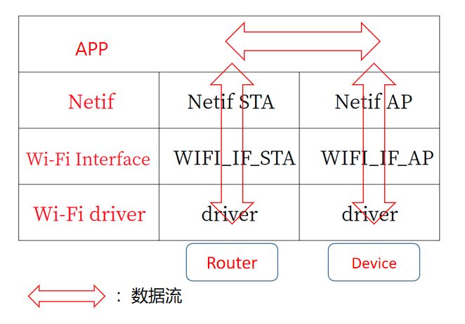
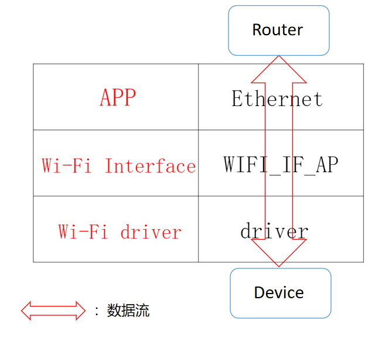
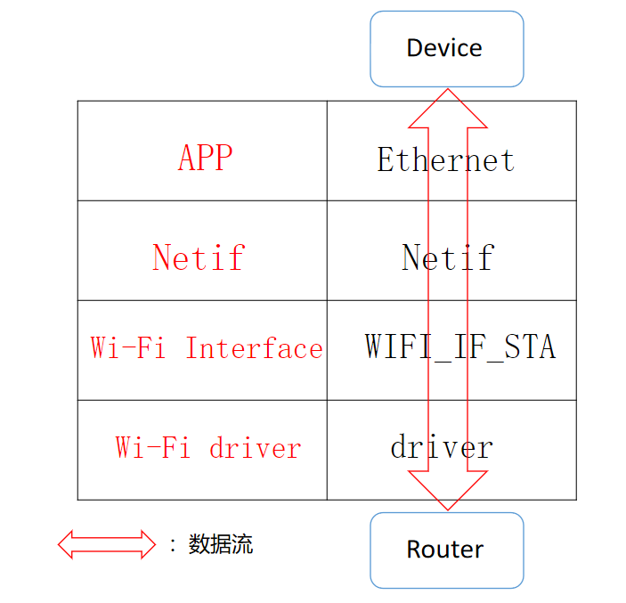
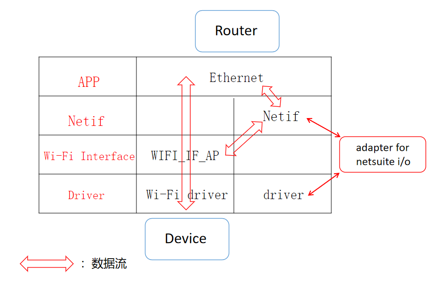
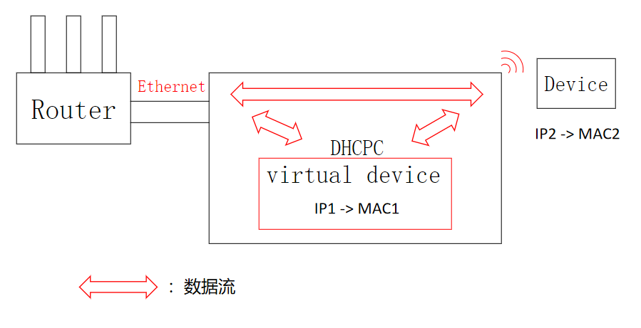

# ESP-Gateway 方案介绍

## 1.Wi-Fi Router

### 功能介绍：

将 Wi-Fi 设置为 APSTA 模式，作为 STA 连接至无线路由器，同时启动 AP 热点供其他智能设备连接。

### 原理：

- APP 层通过 `esp_netif_create_default_wifi_sta()` 、`esp_netif_create_default_wifi_ap()` 接口分别对 WIFI STA 和 WIFI AP 进行初始化

- 创建两个对应的 esp-netif object，并根据不同的 Wi-Fi 接口实现与对应 esp-netif object 的绑定
- 创建对应不同 esp-netif object 一起使用的 Wi-Fi driver

## 2.eth2ap

### 功能介绍：

将 Wi-Fi 设置为 AP 模式，同时初始化以太网驱动，ESP-Gateway 设备通过网线接入网口后开启热点，周围的智能设备连接其热点后即可联网。

### 原理

- 初始化 Ethernet 和 Wi-Fi，分别向系统事件循环注册 event_handle
- 当 Router 发送数据时，数据流通过以太网线传输给以太网 PHY 芯片，APP 层以太网驱动传输过来的 Data buffer 通过 `esp_wifi_internal_tx()` 传输至 Wi-Fi 驱动层
- 当设备端有数据发送给 Router 时，底层 Wi-Fi 驱动通过 callback 形式将 Wi-Fi 数据传递至 APP 层，并由 `esp_eth_transmit()` 发送 buffer 至以太网 PHY 芯片

>该原理图不涉及以太网底层通讯流程，APP 层以太网收到 Wi-Fi 数据也要通过 PHY 底层才可以传输数据至以太网网口

## 3.eth2sta

### 功能介绍：

将 Wi-Fi 设置为 STA 模式，网线接口引出网线插入至具有 LAN 口的智能设备（电脑等）上后连接 Wi-Fi 至无线路由器，智能设备即可联网。

### 原理：

- 初始化 Ethernet 和 Wi-Fi，分别向系统事件循环注册 event_handle
- 网线插入至具有 LAN 口的智能设备后，设备通过以太网发送数据，数据流通过以太网线传输给以太网 PHY 芯片，APP 层将 Wi-Fi STA 的 MAC 地址复制为以太网帧中的源 MAC 地址字段（即设备 MAC），并连接无线路由器
- 当 Router 发送数据时，底层 Wi-Fi 驱动通过 callback 形式将 Wi-Fi 数据传递至 APP 层，并由 `esp_eth_transmit()` 发送 buffer 至以太网 PHY 芯片
- 当设备端发送数据时，数据流通过以太网线传输给以太网 PHY 芯片，APP 层以太网驱动传输过来的 Data buffer 通过 `esp_wifi_internal_tx()` 传输至 Wi-Fi 驱动层

> 该原理图不涉及以太网底层通讯流程，APP 层以太网收到 Wi-Fi 数据也要通过 PHY 底层才可以传输数据至以太网网口

##   4.eth2ap+virtual_device

### 功能介绍：

基本功能同 [2.eth2ap](#eth2ap) ，另外在 ESP32 内部通过 adapter for netsuite i/o 增加一个虚拟设备，使得局域网内的智能设备可以与 ESP32 进行 TCP 通信。

### 原理：

- 初始化 Ethernet 和 Wi-Fi，分别向系统事件循环注册 event_handle
- 创建一个 esp-netif object 作为 virtual netif，并与 adapter for netsuite i/o 进行绑定 
- 待以太网连接成功，开启 Wi-Fi，并使能 DHCPC for virtual netif，随即 Router 向虚拟设备分配了一个 IP 地址，对应的虚拟设备 MAC 地址为初始化以太网时获得的 MAC 地址
- 当 Router 发送数据时，数据流通过以太网线传输给以太网 PHY 芯片，以太网驱动传输过来的 Data buffer 在 APP 层通过逻辑判断选择两个去向，如果此时有设备连接该 AP，即通过 `esp_wifi_internal_tx()` 传输至 Wi-Fi 驱动层；如果以太网数据帧目标地址字段与虚拟设备 MAC地址，广播地址、定义的 ipv4、ipv6 组播地址任意一个相符合，即将原始数据包通过 virtual netif 传递到适当的TCP / IP堆栈
- 当设备端发送数据时，底层 Wi-Fi 驱动通过 callback 形式传输过来的 Wi-Fi Data buffer 同样也会选择两个去向，如果此时以太网连接未断开，由 `esp_eth_transmit()` 发送 Wi-Fi Data buffer 至以太网 PHY 芯片；如果 Wi-Fi Data buffer 的目标地址字段与虚拟设备 MAC地址，广播地址、定义的 ipv4、ipv6 组播地址任意一个相符合，即将原始数据包通过 virtual netif 传递到适当的TCP / IP堆栈
- TCP / IP 堆栈收到 virtual netif 传递的原始数据包后会进行处理，并通过底层 esp-netif-driver 配置的回调函数来返回数据，返回的数据包在 APP 层进行判断，如果此时有设备连接该 AP，即通过 `esp_wifi_internal_tx()` 传输至 Wi-Fi 驱动层；如果此时以太网连接未断开，即通过 `esp_eth_transmit()` 发送 Data buffer 至以太网 PHY 芯片

>该原理图不涉及以太网底层通讯流程，APP 层以太网收到 Wi-Fi 数据也要通过 PHY 底层才可以传输数据至以太网网口

