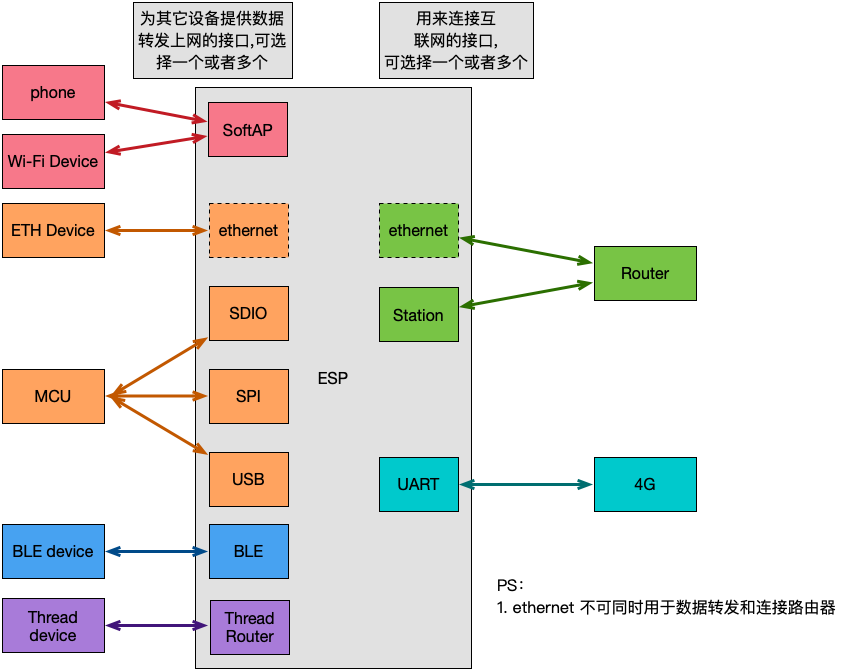

# ESP-Gateway 智能网关方案

本文档将介绍 ESP-Gateway 智能网关方案的配置流程和使用方法


# 目录

- [1.概述](#1)
- [2.硬件准备](#2)
- [3.环境搭建](#3)
- [4.SDK 准备](#4)
- [5.配置项介绍](#5)
- [6.编译 && 烧写 && 运行](#6)
- [7.方案优势](#7)

## <span id = "1">1.概述</span>

乐鑫 ESP-Gateway 智能网关方案已经适配乐鑫多种芯片：

| Chip     | ESP-IDF Release/v4.3                                         | ESP-IDF Release/v4.4                                         |
| -------- | ------------------------------------------------------------ | ------------------------------------------------------------ |
| ESP32    | [](https://camo.githubusercontent.com/bd5f5f82b920744ff961517942e99a46699fee58737cd9b31bf56e5ca41b781b/68747470733a2f2f696d672e736869656c64732e696f2f62616467652f2d737570706f727465642d677265656e) | [](https://camo.githubusercontent.com/bd5f5f82b920744ff961517942e99a46699fee58737cd9b31bf56e5ca41b781b/68747470733a2f2f696d672e736869656c64732e696f2f62616467652f2d737570706f727465642d677265656e) |
| ESP32-C3 |                                                              | [](https://camo.githubusercontent.com/bd5f5f82b920744ff961517942e99a46699fee58737cd9b31bf56e5ca41b781b/68747470733a2f2f696d672e736869656c64732e696f2f62616467652f2d737570706f727465642d677265656e) |
| ESP32-S2 |                                                              | [](https://camo.githubusercontent.com/bd5f5f82b920744ff961517942e99a46699fee58737cd9b31bf56e5ca41b781b/68747470733a2f2f696d672e736869656c64732e696f2f62616467652f2d737570706f727465642d677265656e) |
| ESP32-S3 |                                                              | [](https://camo.githubusercontent.com/bd5f5f82b920744ff961517942e99a46699fee58737cd9b31bf56e5ca41b781b/68747470733a2f2f696d672e736869656c64732e696f2f62616467652f2d737570706f727465642d677265656e) |
| ESP32-H2 |                                                              | TODO                                                         |
| ESP32-C2 |                                                              | TODO                                                         |

ESP-Gateway 方案提供多个网络接口，不同的网络接口可以分为两大类：

- 用来连接互联网的接口

- 为其他设备提供数据转发上网功能的接口

用户可以通过多种不同的网络接口组合来实现个性化的智能网关方案，最大程度地发挥乐鑫芯片的网络优势。




根据接口的不同组合可以实现多种功能，如下表：

|                    | 无线热点     | 以太网接口 | USB 接口 | SPI 接口 | SDIO 接口 | BLE 接口 | Thread 接口          |
| ------------------ | ------------ | ---------- | -------- | -------- | --------- | -------- | -------------------- |
| **无线 Wi-Fi**     | Wi-Fi 路由器 | 无线网卡   | 无线网卡 | 无线网卡 | 无线网卡  | BLE 网关 | Thread Border Router |
| **以太网**         | Wi-Fi 路由器 | 不支持     | 有线网卡 | 有线网卡 | 有线网卡  | BLE 网关 | Thread Border Router |
| **Cat.1 4G(UART)** | 4G 热点      | 4G 网卡    | 4G 网卡  | 4G 网卡  | 4G 网卡   | BLE 网关 | Thread Border Router |
| **Cat.1 4G(USB)**  | 4G 热点      | 4G 网卡    | 不支持   | 4G 网卡  | 4G 网卡   | BLE 网关 | Thread Border Router |

备注：

- **第一列的无线 Wi-Fi、以太网、Cat.1 4G(UART)、Cat.1 4G(USB) 为连接到互联网的接口**
- **第一行的无线热点、以太网接口、USB 接口、SPI 接口、SDIO 接口、BLE 接口、Thread 接口为为其它设备提供上网功能的接入接口**


根据上表，我们将网络数据转发功能概括为了以下几种应用场景：Wi-Fi 路由器、4G 热点、4G 网卡、无线网卡、有线网卡、BLE 网关和 Thread Border Router，不同芯片对其的支持情况如下表所示：

| ESP 设备 | Wi-Fi 路由器                                                 | 4G 热点                                                      | 4G 网卡                                                      | 无线网卡                                                     | 有线网卡                                                     | BLE 网关 | Thread Border Router |
| -------- | ------------------------------------------------------------ | ------------------------------------------------------------ | ------------------------------------------------------------ | ------------------------------------------------------------ | ------------------------------------------------------------ | -------- | -------------------- |
| ESP32    | [](https://camo.githubusercontent.com/bd5f5f82b920744ff961517942e99a46699fee58737cd9b31bf56e5ca41b781b/68747470733a2f2f696d672e736869656c64732e696f2f62616467652f2d737570706f727465642d677265656e) | [](https://camo.githubusercontent.com/bd5f5f82b920744ff961517942e99a46699fee58737cd9b31bf56e5ca41b781b/68747470733a2f2f696d672e736869656c64732e696f2f62616467652f2d737570706f727465642d677265656e) | [](https://camo.githubusercontent.com/bd5f5f82b920744ff961517942e99a46699fee58737cd9b31bf56e5ca41b781b/68747470733a2f2f696d672e736869656c64732e696f2f62616467652f2d737570706f727465642d677265656e)(ETH/SDIO/SPI) | [](https://camo.githubusercontent.com/bd5f5f82b920744ff961517942e99a46699fee58737cd9b31bf56e5ca41b781b/68747470733a2f2f696d672e736869656c64732e696f2f62616467652f2d737570706f727465642d677265656e)(ETH/SDIO/SPI) | [](https://camo.githubusercontent.com/bd5f5f82b920744ff961517942e99a46699fee58737cd9b31bf56e5ca41b781b/68747470733a2f2f696d672e736869656c64732e696f2f62616467652f2d737570706f727465642d677265656e)(SDIO/SPI) | TODO     | TODO                 |
| ESP32-C3 | [](https://camo.githubusercontent.com/bd5f5f82b920744ff961517942e99a46699fee58737cd9b31bf56e5ca41b781b/68747470733a2f2f696d672e736869656c64732e696f2f62616467652f2d737570706f727465642d677265656e) | [](https://camo.githubusercontent.com/454168caab8b950c543c742ed575f11641ae9eb80be0ad511df3cb1c1b783baa/68747470733a2f2f696d672e736869656c64732e696f2f62616467652f2d707265766965772d6f72616e6765) | [](https://camo.githubusercontent.com/bd5f5f82b920744ff961517942e99a46699fee58737cd9b31bf56e5ca41b781b/68747470733a2f2f696d672e736869656c64732e696f2f62616467652f2d737570706f727465642d677265656e)(ETH/SPI) | [](https://camo.githubusercontent.com/bd5f5f82b920744ff961517942e99a46699fee58737cd9b31bf56e5ca41b781b/68747470733a2f2f696d672e736869656c64732e696f2f62616467652f2d737570706f727465642d677265656e)(ETH/SPI) | [](https://camo.githubusercontent.com/bd5f5f82b920744ff961517942e99a46699fee58737cd9b31bf56e5ca41b781b/68747470733a2f2f696d672e736869656c64732e696f2f62616467652f2d737570706f727465642d677265656e)(SPI) | TODO     | TODO                 |
| ESP32-S2 | [](https://camo.githubusercontent.com/bd5f5f82b920744ff961517942e99a46699fee58737cd9b31bf56e5ca41b781b/68747470733a2f2f696d672e736869656c64732e696f2f62616467652f2d737570706f727465642d677265656e) | [](https://camo.githubusercontent.com/bd5f5f82b920744ff961517942e99a46699fee58737cd9b31bf56e5ca41b781b/68747470733a2f2f696d672e736869656c64732e696f2f62616467652f2d737570706f727465642d677265656e) | [](https://camo.githubusercontent.com/bd5f5f82b920744ff961517942e99a46699fee58737cd9b31bf56e5ca41b781b/68747470733a2f2f696d672e736869656c64732e696f2f62616467652f2d737570706f727465642d677265656e)(ETH/SPI) | [](https://camo.githubusercontent.com/bd5f5f82b920744ff961517942e99a46699fee58737cd9b31bf56e5ca41b781b/68747470733a2f2f696d672e736869656c64732e696f2f62616467652f2d737570706f727465642d677265656e)(USB/ETH/SPI) | [](https://camo.githubusercontent.com/bd5f5f82b920744ff961517942e99a46699fee58737cd9b31bf56e5ca41b781b/68747470733a2f2f696d672e736869656c64732e696f2f62616467652f2d737570706f727465642d677265656e)(USB/SPI) |          | TODO                 |
| ESP32-S3 | [](https://camo.githubusercontent.com/bd5f5f82b920744ff961517942e99a46699fee58737cd9b31bf56e5ca41b781b/68747470733a2f2f696d672e736869656c64732e696f2f62616467652f2d737570706f727465642d677265656e) | [](https://camo.githubusercontent.com/bd5f5f82b920744ff961517942e99a46699fee58737cd9b31bf56e5ca41b781b/68747470733a2f2f696d672e736869656c64732e696f2f62616467652f2d737570706f727465642d677265656e) | [](https://camo.githubusercontent.com/bd5f5f82b920744ff961517942e99a46699fee58737cd9b31bf56e5ca41b781b/68747470733a2f2f696d672e736869656c64732e696f2f62616467652f2d737570706f727465642d677265656e)(ETH/SPI) | [](https://camo.githubusercontent.com/bd5f5f82b920744ff961517942e99a46699fee58737cd9b31bf56e5ca41b781b/68747470733a2f2f696d672e736869656c64732e696f2f62616467652f2d737570706f727465642d677265656e)(USB/ETH/SPI) | [](https://camo.githubusercontent.com/bd5f5f82b920744ff961517942e99a46699fee58737cd9b31bf56e5ca41b781b/68747470733a2f2f696d672e736869656c64732e696f2f62616467652f2d737570706f727465642d677265656e)(USB/SPI) | TODO     | TODO                 |
| ESP32-H2 | TODO                                                         | TODO                                                         | TODO                                                         | TODO                                                         | TODO                                                         | TODO     | TODO                 |

备注：

- **ESP32、ESP32-C3 没有 USB 接口，使用 <font color=red>USB 网卡 </font>或 <font color=red>Cat.1 4G(USB)</font> 功能请选择 ESP32-S2 或 ESP32-S3**
- **只有 ESP32 支持以太网接口，其它芯片需要外接 SPI 转以太网芯片，ESP32 MAC&PHY 配置可以参考 [Configure MAC and PHY](https://docs.espressif.com/projects/esp-idf/en/latest/esp32/api-reference/network/esp_eth.html#configure-mac-and-phy)**
- **使用 Thread Border Router 时，需要搭配 802.15.4 芯片，如 ESP32-H2**
- **对于 ESP32 SDIO 接口，硬件上有管脚上拉需求，具体可以参考 [SD Pull-up Requirements](https://docs.espressif.com/projects/esp-idf/en/latest/esp32/api-reference/peripherals/sd_pullup_requirements.html)**


### 1.1 Wi-Fi 路由器

ESP-Gateway 可通过无线连接路由器或者以太网网线插入路由器 LAN 口连接网络，同时开启热点，智能设备可以连接至该热点访问网关 IP（默认 192.168.4.1）来进行网页配网，配网成功后用户设备即可通过该 SoftAP 热点上网。

- Gateway 当前支持轻量化的 Mesh 组网功能 —— [LiteMesh](./doc/LiteMesh.md)，用户可以通过自定义方式，灵活实现网络组网、层级分布

- menuconfig（Gateway Configuration->SoftAP Config）中启用 **ESP_GATEWAY_SOFTAP_SSID_END_WITH_THE_MAC**，可以在 SoftAP SSID 末尾增加 MAC 信息

- 单个 Gateway 设备支持最多 10 个 Station 同时连接，多个 Station 设备共享带宽


### 1.2 4G 热点

ESP-Gateway 设备可搭载插有 SIM 卡的移动网络模块，将蜂窝网络转换为 Wi-Fi 信号，周围的智能设备连接其开启的热点后即可联网。

- 已适配 **4G Cat.1** 模块

| UART      | USB             |
| --------- | --------------- |
| A7670C    | ML302-DNLM/CNLM |
| EC600N-CN | Air724UG-NFM    |
| SIM76000  | EC600N-CNLA-N05 |
|           | EC600N-CNLC-N06 |
|           | SIMCom A7600C1  |


### 1.3 4G 网卡

ESP-Gateway 设备可搭载插有 SIM 卡的移动网络模块，网络模块联网后，可通过多个网络接口（ETH/SDIO/SPI）接入 PC 或 MCU，为设备提供上网能力。


<font color=red>**⚠️Note**</font>：

> 使用 4G 网卡方案请联系 sales@espressif.com 来获取源码或固件

### 1.4 无线网卡

ESP-Gateway 设备可通过多个网络接口（USB/ETH/SDIO/SPI）接入 PC 或 MCU，PC 或 MCU 等设备在连接成功后会新增一个网卡，可以通过访问网关 IP 来进行网页配网，为设备提供上网能力。

- USB 线一端连接至 ESP32-S2/S3 的 GPIO19/20，一端连接至 MCU

    |             | USB_DP | USB_DM |
    | ----------- | ------ | ------ |
    | ESP32-S2/S3 | GPIO20 | GPIO19 |

- 使用 SPI/SDIO 接口需要对 MCU(Host) 侧进行配置，具体依赖项设置引导，请参考 **[Linux_based_readme](./doc/Linux_based_readme.md)**

- SDIO 硬件连线和 MCU(Host) 配置，详情请参考 **[SDIO_setup](./doc/SDIO_setup.md)**

- SPI 硬件连线和 MCU(Host) 配置，详情请参考 **[SPI_setup](./doc/SPI_setup.md)**


<font color=red>**⚠️Note**</font>：

> 使用无线网卡方案请联系 sales@espressif.com 来获取源码或固件

### 1.5 有线网卡

ESP-Gateway 设备将以太网网线插入路由器 LAN 口连接网络，同时通过多个网络接口（SoftAP/USB/SDIO/SPI）接入 PC 或 MCU，为设备提供上网能力。

- USB 线一端连接至 ESP32-S2/S3 的 GPIO19/20，一端连接至 MCU

    |             | USB_DP | USB_DM |
    | ----------- | ------ | ------ |
    | ESP32-S2/S3 | GPIO20 | GPIO19 |

- 使用 SPI/SDIO 接口需要对 MCU(Host) 侧进行配置，具体依赖项设置引导，请参考 **[Linux_based_readme](./doc/Linux_based_readme.md)**

- SDIO 硬件连线和 MCU(Host) 配置，详情请参考 **[SDIO_setup](./doc/SDIO_setup.md)**

- SPI 硬件连线和 MCU(Host) 配置，详情请参考 **[SPI_setup](./doc/SPI_setup.md)**


⚠️<font color=red>**Note:** </font>

> 使用有线网卡方案请联系 sales@espressif.com 来获取源码或固件

## <span id = "2">2.硬件准备</span>

- **Linux 环境**

用来执行编译 & 烧写 & 运行等操作的必须环境。

> windows 用户可安装虚拟机，在虚拟机中安装 Linux。

- **ESP 设备**

ESP 设备包括 ESP 芯片，ESP 模组，ESP 开发板等。

> - **针对以太网路由器**、**以太网无线网卡**功能：
>     - ESP32 需要额外增加一个以太网 PHY 芯片
>     - 其它 ESP 芯片需要 SPI 转以太网芯片
> - **随身 Wi-Fi** 功能需要额外增加一个插有 SIM 卡的移动网络模块

- **USB 线**

连接 PC 和 ESP 设备，用来烧写/下载程序，查看 log 等。

## <span id = "3">3.环境搭建</span>

**如果您熟悉 ESP 开发环境，可以很顺利理解下面步骤; 如果您不熟悉某个部分，比如编译，烧录，需要您结合官方的相关文档来理解。如您需阅读 [ESP-IDF 编程指南](https://docs.espressif.com/projects/esp-idf/zh_CN/latest/index.html)文档等。**

### 3.1 编译器环境搭建

- 根据[官方链接](https://github.com/espressif/esp-idf/blob/master/docs/zh_CN/get-started/linux-setup.rst)中 **工具链的设置**，下载 toolchain
- toolchain 设置参考 [ESP-IDF 编程指南](https://docs.espressif.com/projects/esp-idf/zh_CN/latest/get-started/index.html#get-started-setup-toolchain)。

### 3.2 烧录工具/下载工具获取

- 烧录工具位于 [esp-idf](https://github.com/espressif/esp-idf) 下 `./components/esptool_py/esptool/esptool.py`
- esptool 功能参考:

```
$ ./components/esptool_py/esptool/esptool.py --help
```

## <span id = "4">4.SDK 准备</span>

- 获取 Espressif SDK [ESP-IDF](https://github.com/espressif/esp-idf)
- 为确保成功获取了完整的 ESP-IDF，请在终端中输入 `idf.py --version`，如果输出结果类似于 `ESP-IDF v4.4-dev-3675-g35b20cadce`，则代表安装成功。详细的安装和配置说明请参考[快速入门文档](https://docs.espressif.com/projects/esp-idf/zh_CN/latest/esp32s2/get-started/index.html)。
- 成功获取到 ESP-IDF 之后，请将 ESP-IDF 版本切换到 `release/v4.4`  分支。
- 给 ESP-IDF 打上 Patch，详情请参考 [Patch for ESP-IDF](./idf_patch/README.md)

## <span id = "5">5.配置项</span>

**连接外部网络的接口选择**


**提供网络数据转发给其他设备的接口选择**


- 用户可选择不同的接口组合来实现相应的功能
- 暂时不支持同时选择多个网络数据转发接口（该功能将会在以后版本中进行支持）
- 开启 Set Vendor IE info 选项后可以使能 LiteMesh 功能，详情请参考 [LiteMesh](./doc/LiteMesh.md)

**ETH 配置项**


**Modem 配置项**


## <span id = "6">6.编译 && 烧写 && 运行</span>

### 6.1 编译

在 esp-gateway 目录下执行：
```
$ idf.py menuconfig
```
根据 [5.配置项](#5) 选择合适的配置选项，配置完成之后执行以下命令生成 bin
```
$ idf.py build
```

### 6.2 擦除 & 编译烧写 & 下载固件 & 查看 log

将 USB 线连接好 ESP 设备和 PC，确保烧写端口正确。

#### 6.2.1 烧录程序

```
$ idf.py flash
```

#### 6.2.3 运行

```
$ idf.py monitor
```

>也可执行组合命令 `idf.py build flash monitor` 来执行编译、烧录、查看监视器

### 6.3 网页配网

对于 **Wi-Fi 路由器**方案以及**无线网卡方案**，PC 或 MCU 连接热点成功并获取到 IP 地址后，可以访问网关 IP 来进行网页配网


## <span id = "7">7.方案优势</span>

| 功能模式       | 优势                                                                                                                |
| ------------- | ----------------------------------------------------------------------------------------------------------------   |
| Wi-Fi 路由器（Station） | 可作为 Wi-Fi 中继或 Wi-Fi 信号放大器、有效减轻实际路由器的承载力，同时扩大无线覆盖范围                                         |
| Wi-Fi 路由器（ETH） | 可以减少实际使用的路由器数量、部署成本低                                                                                 |
| 4G 热点 | 无需配网、移动性强、应用于共享场景中（共享按摩椅、共享充电宝），仅需一台共享设备搭载移动网络模块，其他设备连接其热点即可联网，大大节约成本 |
| 无线网卡（ETH） | 免驱动、支持用户在任意位置部署需要通过网线联网的 MCU                                                                     |
| 无线网卡（USB） | 免驱动、可热插拔、使用简便，开发成本低 |
| 无线网卡（SPI/SDIO） | 传输速率高 |

**部分功能演示视频请参考 [ESP-Gateway 视频演示](https://www.bilibili.com/video/BV1wo4y1R7NG)**
