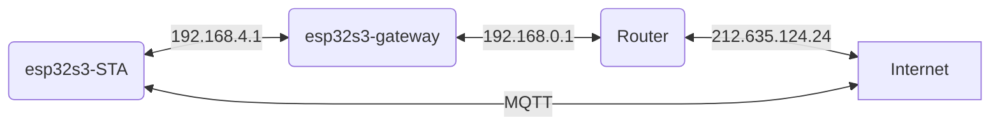

# ESP-Gateway Long Range* Smart Gateway Solution

ESP-Gateway is a smart gateway solution offered by Espressif, here you will find the modified version that allows espressif WiFi Long Range mode, which supports up to **1 km** of data traffic.



# Field test

* The [documented](https://docs.espressif.com/projects/esp-idf/en/v4.4.2/esp32s3/api-guides/wifi.html#lr-throughput) throughput is 1/2 Mbps and 1/4 Mbps.

* Due to 4dB more sensitivity on Long Range mode, the range is expected to be 2.5 times the distance of 11B.

WHAT WE GOT (#TODO)

# Table of Contents

- [1. Overview](#1)
- [2. Hardware](#2)
- [3. Development Environment](#3)
- [4. SDK](#4)
- [5. Configuration](#5)
- [6. Build & Flash & Monitor the Output](#6)
- [7. Network Configuration](#7)
- [8. Solution Highlights](#8)
- [9. GPIO Map](#9)

## <span id = "1">1. Overview</span>

ESP-Gateway is supported by various Espressif chips, as shown in the table below:

| Chip     | ESP-IDF Release/v4.4.2                                         | ESP-IDF Release/v5.0                                         |
| -------- | ------------------------------------------------------------ | ------------------------------------------------------------ |
| ESP32    | [](https://camo.githubusercontent.com/bd5f5f82b920744ff961517942e99a46699fee58737cd9b31bf56e5ca41b781b/68747470733a2f2f696d672e736869656c64732e696f2f62616467652f2d737570706f727465642d677265656e) | [](https://camo.githubusercontent.com/bd5f5f82b920744ff961517942e99a46699fee58737cd9b31bf56e5ca41b781b/68747470733a2f2f696d672e736869656c64732e696f2f62616467652f2d737570706f727465642d677265656e) |
| ESP32-S3 | [](https://camo.githubusercontent.com/bd5f5f82b920744ff961517942e99a46699fee58737cd9b31bf56e5ca41b781b/68747470733a2f2f696d672e736869656c64732e696f2f62616467652f2d737570706f727465642d677265656e) | [](https://camo.githubusercontent.com/bd5f5f82b920744ff961517942e99a46699fee58737cd9b31bf56e5ca41b781b/68747470733a2f2f696d672e736869656c64732e696f2f62616467652f2d737570706f727465642d677265656e) |

The ESP-Gateway solution provides several network interfaces, which can be divided into two main categories:

- Interfaces for connecting to the Internet

- Interfaces for forwarding network packets for other devices so that they can access the Internet

Users can realize personalized smart gateway solutions through different network interface combinations to maximize the network advantages of Espressif chips.

A variety of functions can be achieved depending on the combination of interfaces, as shown in the table below:

|                    | Wireless Hotspot     |
| ------------------ | ------------ |
| **Wi-Fi**     | Wi-Fi Long Range Router |
| **Ethernet**         | Wi-Fi Long Range Router |
| **Cat.1 4G (UART)** | 4G Long Range Hotspot      |
| **Cat.1 4G (USB)**  | 4G Long Range Hotspot      |

Notes:

- **NIC: network interface controller**
- **Wi-Fi, Ethernet, Cat.1 4G (UART), and Cat.1 4G (USB) in the first column are interfaces for connecting to the Internet**
- **The wireless hotspot is interface that provide Internet access to other devices.**
- **ESP32 doesn't have a USB interface and the USB interface for ESP32-C3 can't be used for application communication. If you need to use <font color=red> USB NIC </font> or <font color=red> Cat.1 4G (USB)</font> function, please choose ESP32-S2 or ESP32-S3.**
- **Only ESP32 supports Ethernet interface. Other chips need to connect with external Ethernet chip over SPI. For ESP32 MAC & PHY configuration, please refer to [Configure MAC and PHY](https://docs.espressif.com/projects/esp-idf/en/latest/esp32/api-reference/network/esp_eth.html#configure-mac-and-phy).**
- **For ESP32 SDIO interface, the pin pull-up requirements should be applied to the hardware. For details, please refer to [SD Pull-up Requirements](https://docs.espressif.com/projects/esp-idf/en/latest/esp32/api-reference/peripherals/sd_pullup_requirements.html).**

### 1.1 Wi-Fi Router

ESP-Gateway device can connect to the network by connecting to the router via Wi-Fi or by plugging the Ethernet cable into the LAN port of the router. Then other smart devices can connect to the SoftAP hotspot from the ESP-Gateway to access the Internet.

- Currently, ESP-Gateway supports lightweight mesh networking — [LiteMesh](./doc/LiteMesh.md). Users can customize the hierarchical network provision.

- By enabling ``ESP_GATEWAY_SOFTAP_SSID_END_WITH_THE_MAC`` in menuconfig (``Gateway Configuration`` > ``SoftAP Config``), users can add MAC information at the end of SoftAP SSID.

- A single ESP-Gateway device supports up to 10 stations connected at the same time, and bandwidth is shared by these stations.

- You need to configure your network if the ESP-Gateway device connects to the router via Wi-Fi. Currently, the following ways are supported:

    > - [Configure the network on web page](#web)
    > - [Configure the network through Wi-Fi Provisioning (Bluetooth LE)](#wifi_provisioning)（ESP32-S2 not supported）


### 1.2 4G Hotspot

ESP-Gateway device can be equipped with a mobile network module with a SIM card and then convert the cellular network into a Wi-Fi signal. The surrounding smart devices can connect to the hotspot from the ESP-Gateway device to gain Internet access.

The table below shows modules that are compatible with 4G Cat.1.

| UART      | USB             |
| --------- | --------------- |
| A7670C    | ML302-DNLM/CNLM |
| EC600N-CN | Air724UG-NFM    |
| SIM76000  | EC600N-CNLA-N05 |
|           | EC600N-CNLC-N06 |
|           | SIMCom A7600C1  |


## <span id = "2">2. Hardware</span>

- **Linux Environment**

The Linux environment is necessary for building, flashing, and running.

> For Windows users, it is recommended to install a virtual machine for setting up the Linux environment.

- **ESP devices**

ESP devices include ESP chips, ESP modules, ESP development boards, etc.

> - For **Ethernet Router** and **Ethernet Wireless Card** features:
>    - ESP32 requires an additional Ethernet PHY chip.
>    - Other ESP chips need a chip to convert SPI to Ethernet.
> - For the **Portable Wi-Fi** feature, ESP device requires an additional mobile network module with SIM card.

- **USB Cable**

USB cable is used to connect PC with ESP devices, flash or download programs, and view logs, etc.


## <span id = "3">3. Set Up Development Environment</span>

If you are familiar with the ESP development environment, you can easily understand the following steps. If you are not familiar with a certain part, such as building or flashing, please refer to [ESP-IDF Programming Guide](https://docs.espressif.com/projects/esp-idf/en/latest/index.html).


### 3.1 Download & Set up Toolchain

Please refer to [Standard Toolchain Setup for Linux](https://docs.espressif.com/projects/esp-idf/en/latest/esp32/get-started/linux-macos-setup.html#setting-up-development-environment) to download and set up the toolchain for building your project.

### 3.2 Flash/Download Tool

- The flash tool is located under `./components/esptool_py/esptool/esptool.py` of [ESP-IDF](https://github.com/espressif/esp-idf).

- Run the following command to get the full features for esptool:

```
$ ./components/esptool_py/esptool/esptool.py --help
```

### 3.3 Clone ESP-Long-Range-Gateway Repository

```
$ git clone --recursive https://github.com/ldab/esp-gateway-long-range.git
```

## <span id = "4">4. Get SDK </span>

- Get Espressif SDK from [ESP-IDF](https://github.com/espressif/esp-idf).

- To ensure that the ESP-IDF is successfully obtained, please enter `idf.py --version` in the terminal. If the output is similar to `ESP-IDF v4.4.2`, ESP-IDF is installed successfully. For detailed installation and configuration instructions, please refer to [ESP-IDF Get Started](https://docs.espressif.com/projects/esp-idf/en/latest/esp32s2/get-started/index.html).

- After successfully obtaining ESP-IDF, please switch its version to the `release/v4.4.2` branch.


## <span id = "5">5. Configuration</span>

**Select the interface for connecting to the Internet**


**Select the interface for forwarding network packets for other devices**


- Users can choose a combination of different interfaces to achieve different functions.

- Whether to support the selection of multiple network data forwarding interfaces to provide network functions to different devices?

    | IDF Version          |             | Note                                                         |
    | -------------------- | ----------- | ------------------------------------------------------------ |
    | ESP-IDF Release/v4.4.2 | Not Support | Only one network data forwarding interface can be selected   |
    | ESP-IDF Release/v5.0 | **Support** | Currently, SDIO and SPI interfaces cannot be selected at the same time |

    ```
                                 +-- USB  <-+->  Computer
                                 |
    RasPi + ethsta0 +-- SPI -- ESP32 --> External WiFi（Router）
                                 |
                                 +-- SoftAP <-+-> Phone
    ```

- The LiteMesh function can be enabled through the *Enable LiteMesh* option. For details, please refer to [LiteMesh](./doc/LiteMesh.md).

**ETH Configuration**


**Modem Configuration**


## <span id = "6">6. Build & Flash & Monitor the Output</span>

### 6.1 Build the Project

Navigate to the ``esp-gateway`` directory and run the following command:

```
$ idf.py menuconfig
```

After selecting the appropriate configuration items according to [Configuration Items](#5), run the following command to generate the bin file.

```
$ idf.py build
```

### 6.2 Flash & Monitor the Output

Connect the ESP device to the PC with a USB cable, and make sure the right port is used.

#### 6.2.1 Flash onto the Device

```
$ idf.py flash
```

#### 6.2.3 Monitor the Output

```
$ idf.py monitor
```

> You can combine building, flashing and monitoring into one step by running:  `idf.py build flash monitor`.

## <span id = "7">7. Network Configuration</span>

### <span id = "web">7.1 Configure Network on Web Page</span>

After the PC or MCU connects to the hotspot from the ESP-Gateway device and obtains the IP address successfully, it can configure the network on the web page by accessing the gateway IP.


## <span id = "8">7.Solution Highlights</span>

| Features       | Highlights                                                                                                                |
| ------------- | ----------------------------------------------------------------------------------------------------------------   |
| Wi-Fi Router (Station) | Act as a Wi-Fi repeater or Wi-Fi signal amplifier, effectively reducing the burden of the router and expanding Wi-Fi coverage                                         |
| Wi-Fi Router (ETH) | Reduce the number of routers used and lower the deployment cost  |
| 4G Hotspot | Network provision is not required; strong mobility; can be used for shared massage chairs, shared power bank and other similar scenarios; low cost (only one shared device equipped with a mobile network module is required, and other devices can connect to the Internet by simply connecting to its hotspot |

**Please refer to the [ESP-Gateway Video](https://www.bilibili.com/video/BV1wo4y1R7NG) which demonstrates some of the features of the ESP-Gateway.**

## <span id = "9">9.GPIO Map</span>

