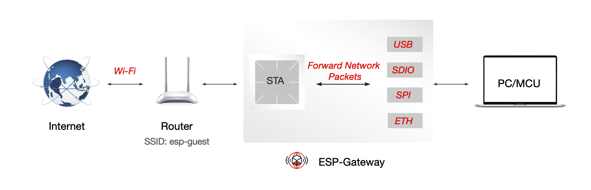
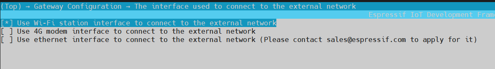
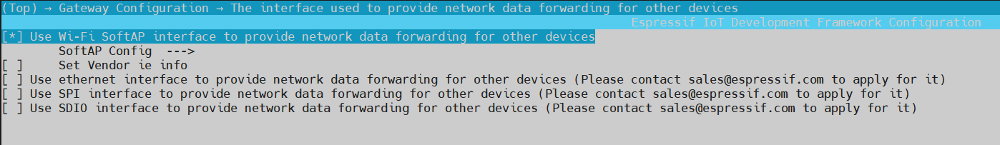
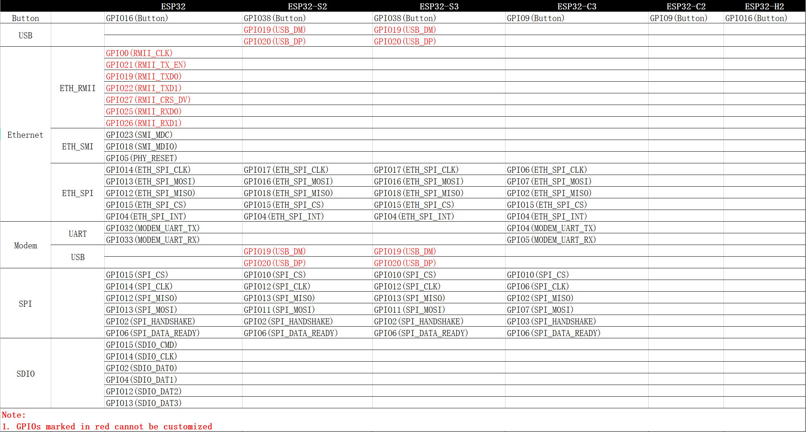

# ESP-IOT-Bridge Smart Gateway Solution

- [中文版](README_CN.md)

ESP-IOT-Bridge smart gateway solution is mainly aimed at bridging between various network interfaces in iot application scenarios, such as SPI, SDIO, USB, Wi-Fi, Ethernet and other network interfaces. ESP-IOT-Bridge is a smart gateway solution offered by Espressif. This document describes how to configure and use ESP-IOT-Bridge(the solution was originally named ESP-Gateway, because this solution does not involve protocol proxy conversion, but only data forwarding, so it is renamed ESP-IOT-Bridge).


# Table of Contents

- [1. Overview](#1)
- [2. Hardware](#2)
- [3. Development Environment](#3)
- [4. SDK](#4)
- [5. Configuration](#5)
- [6. Build & Flash & Monitor the Output](#6)
- [7. Network Configuration](#7)
- [8. Solution Highlights](#8)
- [9. GPIO Map](#9)

## <span id = "1">1. Overview</span>

ESP-IOT-Bridge is supported by various Espressif chips, as shown in the table below:

| Chip     | ESP-IDF Release/v4.4                                         | ESP-IDF Release/v5.0                                         |
| -------- | ------------------------------------------------------------ | ------------------------------------------------------------ |
| ESP32    | [](https://camo.githubusercontent.com/bd5f5f82b920744ff961517942e99a46699fee58737cd9b31bf56e5ca41b781b/68747470733a2f2f696d672e736869656c64732e696f2f62616467652f2d737570706f727465642d677265656e) | [](https://camo.githubusercontent.com/bd5f5f82b920744ff961517942e99a46699fee58737cd9b31bf56e5ca41b781b/68747470733a2f2f696d672e736869656c64732e696f2f62616467652f2d737570706f727465642d677265656e) |
| ESP32-C3 | [](https://camo.githubusercontent.com/bd5f5f82b920744ff961517942e99a46699fee58737cd9b31bf56e5ca41b781b/68747470733a2f2f696d672e736869656c64732e696f2f62616467652f2d737570706f727465642d677265656e) | [](https://camo.githubusercontent.com/bd5f5f82b920744ff961517942e99a46699fee58737cd9b31bf56e5ca41b781b/68747470733a2f2f696d672e736869656c64732e696f2f62616467652f2d737570706f727465642d677265656e) |
| ESP32-S2 | [](https://camo.githubusercontent.com/bd5f5f82b920744ff961517942e99a46699fee58737cd9b31bf56e5ca41b781b/68747470733a2f2f696d672e736869656c64732e696f2f62616467652f2d737570706f727465642d677265656e) | [](https://camo.githubusercontent.com/bd5f5f82b920744ff961517942e99a46699fee58737cd9b31bf56e5ca41b781b/68747470733a2f2f696d672e736869656c64732e696f2f62616467652f2d737570706f727465642d677265656e) |
| ESP32-S3 | [](https://camo.githubusercontent.com/bd5f5f82b920744ff961517942e99a46699fee58737cd9b31bf56e5ca41b781b/68747470733a2f2f696d672e736869656c64732e696f2f62616467652f2d737570706f727465642d677265656e) | [](https://camo.githubusercontent.com/bd5f5f82b920744ff961517942e99a46699fee58737cd9b31bf56e5ca41b781b/68747470733a2f2f696d672e736869656c64732e696f2f62616467652f2d737570706f727465642d677265656e) |
| ESP32-H2 | TODO                                                         | TODO                                                         |
| ESP32-C2 | *N/A*                                                        | TODO                                                         |

The ESP-IOT-Bridge solution provides several network interfaces, which can be divided into two main categories:

- Interfaces for connecting to the Internet

- Interfaces for forwarding network packets for other devices so that they can access the Internet

Users can realize personalized smart bridge solutions through different network interface combinations to maximize the network advantages of Espressif chips.


A variety of functions can be achieved depending on the combination of interfaces, as shown in the table below:

|                    | Wireless Hotspot     | Ethernet Interface | USB Interface | SPI Interface | SDIO Interface | Bluetooth LE Interface | Thread Interface          |
| ------------------ | ------------ | ---------- | -------- | -------- | --------- | -------- | -------------------- |
| **Wi-Fi**     | Wi-Fi Router | Wireless NIC   | Wireless NIC | Wireless NIC | Wireless NIC  | Bluetooth LE Bridge | Thread Border Router |
| **Ethernet**         | Wi-Fi Router | Unsupported     | Wired NIC | Wired NIC | Wired NIC  | Bluetooth LE Bridge | Thread Border Router |
| **Cat.1 4G (UART)** | 4G Hotspot      | 4G NIC    | 4G NIC  | 4G NIC  | 4G NIC   | Bluetooth LE Bridge | Thread Border Router |
| **Cat.1 4G (USB)**  | 4G Hotspot      | 4G NIC    | Unsupported   | 4G NIC  | 4G NIC   | Bluetooth LE Bridge | Thread Border Router |

Notes:

- **NIC: network interface controller**
- **Wi-Fi, Ethernet, Cat.1 4G (UART), and Cat.1 4G (USB) in the first column are interfaces for connecting to the Internet**
- **The wireless hotspot, Ethernet interface, USB interface, SPI interface, SDIO interface, Bluetooth LE interface, and Thread interface in the first row are the interfaces that provide Internet access to other devices.**


To summarize, the above table mainly involves the following application scenarios: Wi-Fi Router, 4G hotspot, 4G NIC, wireless NIC, wired NIC, Bluetooth LE bridge and Thread Border Router. The table below shows what scenarios each specific ESP chip supports:

| ESP Chips | Wi-Fi Router                                                 | 4G Hotspot                                                      | 4G NIC                                                      | Wireless NIC                                                     | Wired NIC                                                     | Bluetooth LE Bridge | Thread Border Router |
| -------- | ------------------------------------------------------------ | ------------------------------------------------------------ | ------------------------------------------------------------ | ------------------------------------------------------------ | ------------------------------------------------------------ | -------- | -------------------- |
| ESP32    | [](https://camo.githubusercontent.com/bd5f5f82b920744ff961517942e99a46699fee58737cd9b31bf56e5ca41b781b/68747470733a2f2f696d672e736869656c64732e696f2f62616467652f2d737570706f727465642d677265656e) | [](https://camo.githubusercontent.com/bd5f5f82b920744ff961517942e99a46699fee58737cd9b31bf56e5ca41b781b/68747470733a2f2f696d672e736869656c64732e696f2f62616467652f2d737570706f727465642d677265656e) | [](https://camo.githubusercontent.com/bd5f5f82b920744ff961517942e99a46699fee58737cd9b31bf56e5ca41b781b/68747470733a2f2f696d672e736869656c64732e696f2f62616467652f2d737570706f727465642d677265656e)(ETH/SDIO/SPI) | [](https://camo.githubusercontent.com/bd5f5f82b920744ff961517942e99a46699fee58737cd9b31bf56e5ca41b781b/68747470733a2f2f696d672e736869656c64732e696f2f62616467652f2d737570706f727465642d677265656e)(ETH/SDIO/SPI) | [](https://camo.githubusercontent.com/bd5f5f82b920744ff961517942e99a46699fee58737cd9b31bf56e5ca41b781b/68747470733a2f2f696d672e736869656c64732e696f2f62616467652f2d737570706f727465642d677265656e)(SDIO/SPI) | TODO     | TODO                 |
| ESP32-C3 | [](https://camo.githubusercontent.com/bd5f5f82b920744ff961517942e99a46699fee58737cd9b31bf56e5ca41b781b/68747470733a2f2f696d672e736869656c64732e696f2f62616467652f2d737570706f727465642d677265656e) | [](https://camo.githubusercontent.com/454168caab8b950c543c742ed575f11641ae9eb80be0ad511df3cb1c1b783baa/68747470733a2f2f696d672e736869656c64732e696f2f62616467652f2d707265766965772d6f72616e6765) | [](https://camo.githubusercontent.com/bd5f5f82b920744ff961517942e99a46699fee58737cd9b31bf56e5ca41b781b/68747470733a2f2f696d672e736869656c64732e696f2f62616467652f2d737570706f727465642d677265656e)(ETH/SPI) | [](https://camo.githubusercontent.com/bd5f5f82b920744ff961517942e99a46699fee58737cd9b31bf56e5ca41b781b/68747470733a2f2f696d672e736869656c64732e696f2f62616467652f2d737570706f727465642d677265656e)(ETH/SPI) | [](https://camo.githubusercontent.com/bd5f5f82b920744ff961517942e99a46699fee58737cd9b31bf56e5ca41b781b/68747470733a2f2f696d672e736869656c64732e696f2f62616467652f2d737570706f727465642d677265656e)(SPI) | TODO     | TODO                 |
| ESP32-S2 | [](https://camo.githubusercontent.com/bd5f5f82b920744ff961517942e99a46699fee58737cd9b31bf56e5ca41b781b/68747470733a2f2f696d672e736869656c64732e696f2f62616467652f2d737570706f727465642d677265656e) | [](https://camo.githubusercontent.com/bd5f5f82b920744ff961517942e99a46699fee58737cd9b31bf56e5ca41b781b/68747470733a2f2f696d672e736869656c64732e696f2f62616467652f2d737570706f727465642d677265656e) | [](https://camo.githubusercontent.com/bd5f5f82b920744ff961517942e99a46699fee58737cd9b31bf56e5ca41b781b/68747470733a2f2f696d672e736869656c64732e696f2f62616467652f2d737570706f727465642d677265656e)(ETH/SPI) | [](https://camo.githubusercontent.com/bd5f5f82b920744ff961517942e99a46699fee58737cd9b31bf56e5ca41b781b/68747470733a2f2f696d672e736869656c64732e696f2f62616467652f2d737570706f727465642d677265656e)(USB/ETH/SPI) | [](https://camo.githubusercontent.com/bd5f5f82b920744ff961517942e99a46699fee58737cd9b31bf56e5ca41b781b/68747470733a2f2f696d672e736869656c64732e696f2f62616467652f2d737570706f727465642d677265656e)(USB/SPI) | *N/A* | TODO                 |
| ESP32-S3 | [](https://camo.githubusercontent.com/bd5f5f82b920744ff961517942e99a46699fee58737cd9b31bf56e5ca41b781b/68747470733a2f2f696d672e736869656c64732e696f2f62616467652f2d737570706f727465642d677265656e) | [](https://camo.githubusercontent.com/bd5f5f82b920744ff961517942e99a46699fee58737cd9b31bf56e5ca41b781b/68747470733a2f2f696d672e736869656c64732e696f2f62616467652f2d737570706f727465642d677265656e) | [](https://camo.githubusercontent.com/bd5f5f82b920744ff961517942e99a46699fee58737cd9b31bf56e5ca41b781b/68747470733a2f2f696d672e736869656c64732e696f2f62616467652f2d737570706f727465642d677265656e)(ETH/SPI) | [](https://camo.githubusercontent.com/bd5f5f82b920744ff961517942e99a46699fee58737cd9b31bf56e5ca41b781b/68747470733a2f2f696d672e736869656c64732e696f2f62616467652f2d737570706f727465642d677265656e)(USB/ETH/SPI) | [](https://camo.githubusercontent.com/bd5f5f82b920744ff961517942e99a46699fee58737cd9b31bf56e5ca41b781b/68747470733a2f2f696d672e736869656c64732e696f2f62616467652f2d737570706f727465642d677265656e)(USB/SPI) | TODO     | TODO                 |
| ESP32-H2 | TODO                                                         | TODO                                                         | TODO                                                         | TODO                                                         | TODO                                                         | TODO     | TODO                 |

Notes:

- **ESP32 doesn't have a USB interface and the USB interface for ESP32-C3 can't be used for application communication. If you need to use <font color=red> USB NIC </font> or <font color=red> Cat.1 4G (USB)</font> function, please choose ESP32-S2 or ESP32-S3.**
- **Only ESP32 supports Ethernet interface. Other chips need to connect with external Ethernet chip over SPI. For ESP32 MAC & PHY configuration, please refer to [Configure MAC and PHY](https://docs.espressif.com/projects/esp-idf/en/latest/esp32/api-reference/network/esp_eth.html#configure-mac-and-phy).**
- **When using the Thread Border Router, an 802.15.4 chip is required, such as ESP32-H2.**
- **For ESP32 SDIO interface, the pin pull-up requirements should be applied to the hardware. For details, please refer to [SD Pull-up Requirements](https://docs.espressif.com/projects/esp-idf/en/latest/esp32/api-reference/peripherals/sd_pullup_requirements.html).**


### 1.1 Wi-Fi Router

ESP-IOT-Bridge device can connect to the network by connecting to the router via Wi-Fi or by plugging the Ethernet cable into the LAN port of the router. Then other smart devices can connect to the SoftAP hotspot from the ESP-IOT-Bridge to access the Internet.

- By enabling ``ESP_BRIDGE_SOFTAP_SSID_END_WITH_THE_MAC`` in menuconfig (``Bridge Configuration`` > ``SoftAP Config``), users can add MAC information at the end of SoftAP SSID.

- A single ESP-IOT-Bridge device supports up to 10 stations connected at the same time, and bandwidth is shared by these stations.

- You need to configure your network if the ESP-IOT-Bridge device connects to the router via Wi-Fi. Currently, the following ways are supported:

    > - [Configure the network on web page](#web)
    > - [Configure the network through Wi-Fi Provisioning (Bluetooth LE)](#wifi_provisioning)（ESP32-S2 not supported）


### 1.2 4G Hotspot

ESP-IOT-Bridge device can be equipped with a mobile network module with a SIM card and then convert the cellular network into a Wi-Fi signal. The surrounding smart devices can connect to the hotspot from the ESP-IOT-Bridge device to gain Internet access.

The table below shows modules that are compatible with 4G Cat.1.

| UART      | USB             |
| --------- | --------------- |
| A7670C    | ML302-DNLM/CNLM |
| EC600N-CN | Air724UG-NFM    |
| SIM76000  | EC600N-CNLA-N05 |
|           | EC600N-CNLC-N06 |
|           | SIMCom A7600C1  |


### 1.3 4G NIC

ESP-IOT-Bridge device can be equipped with a mobile network module with a SIM card. After the network module is connected to the Internet, the PC or MCU can be connected to it through the network interface (ETH/SDIO/SPI) to gain Internet access.


<font color=red>**⚠️Note**</font>：

> Please contact sales@espressif.com for source code or firmware for the 4G NIC solution.

### 1.4 Wireless NIC

ESP-IOT-Bridge device can be connected to the PC or MCU through multiple network interfaces (USB/ETH/SDIO/SPI). Once connected, the PC or MCU will have an additional network card. These devices can access the Internet after configuring the network.

- Use a USB cable to connect the GPIO19/20 of ESP32-S2 or ESP32-S3 with MCU.

    |             | USB_DP | USB_DM |
    | ----------- | ------ | ------ |
    | ESP32-S2/S3 | GPIO20 | GPIO19 |

- When using SPI/SDIO interface, it is necessary to configure the MCU (Host). For specific dependencies configuration, please refer to **[Linux_based_readme](./doc/Linux_based_readme.md)**.

- For SDIO hardware connection and MCU (Host) configuration, please refer to **[SDIO_setup](./doc/SDIO_setup.md)**.

- For SPI hardware connection and MCU (Host) configuration, please refer to **[SPI_setup](./doc/SPI_setup.md)**.

- This feature requires you to configure the network. Currently, the following ways are supported:

    > - [Configure the network on web page](#web)
    > - [Configure the network through Wi-Fi Provisioning (Bluetooth LE)](#wifi_provisioning)（not support ESP32-S2）



<font color=red>**⚠️Note**</font>：

> Please contact sales@espressif.com for source code or firmware for wireless NIC solution.

### 1.5 Wired NIC

ESP-IOT-Bridge device can connect to the network by plugging the Ethernet cable into the LAN port of router. PC or MCU can connect with the ESP-IOT-Bridge device through multiple interfaces (USB/SDIO/SPI) to gain internet access.

- Use a USB cable to connect the GPIO19/20 of ESP32-S2 or ESP32-S3 with MCU.

    |             | USB_DP | USB_DM |
    | ----------- | ------ | ------ |
    | ESP32-S2/S3 | GPIO20 | GPIO19 |

- Using SPI/SDIO interface needs to configure the MCU (Host). For specific dependencies configuration, please refer to **[Linux_based_readme](./doc/Linux_based_readme.md)**.

- For SDIO hardware connection and MCU (Host) configuration, please refer to **[SDIO_setup](./doc/SDIO_setup.md)**.

- For SPI hardware connection and MCU (Host) configuration, please refer to **[SPI_setup](./doc/SPI_setup.md)**.


⚠️<font color=red>**Note:** </font>

> Please contact sales@espressif.com for source code or firmware for wired NIC solution.

## <span id = "2">2. Hardware</span>

- **Linux Environment**

The Linux environment is necessary for building, flashing, and running.

> For Windows users, it is recommended to install a virtual machine for setting up the Linux environment.

- **ESP devices**

ESP devices include ESP chips, ESP modules, ESP development boards, etc.

> - For **Ethernet Router** and **Ethernet Wireless Card** features:
>    - ESP32 requires an additional Ethernet PHY chip.
>    - Other ESP chips need a chip to convert SPI to Ethernet.
> - For the **Portable Wi-Fi** feature, ESP device requires an additional mobile network module with SIM card.

- **USB Cable**

USB cable is used to connect PC with ESP devices, flash or download programs, and view logs, etc.


## <span id = "3">3. Set Up Development Environment</span>

If you are familiar with the ESP development environment, you can easily understand the following steps. If you are not familiar with a certain part, such as building or flashing, please refer to [ESP-IDF Programming Guide](https://docs.espressif.com/projects/esp-idf/en/latest/index.html).


### 3.1 Download & Set up Toolchain

Please refer to [Standard Toolchain Setup for Linux](https://docs.espressif.com/projects/esp-idf/en/latest/esp32/get-started/linux-macos-setup.html#setting-up-development-environment) to download and set up the toolchain for building your project.

### 3.2 Flash/Download Tool

- The flash tool is located under `./components/esptool_py/esptool/esptool.py` of [ESP-IDF](https://github.com/espressif/esp-idf).

- Run the following command to get the full features for esptool:

```
$ ./components/esptool_py/esptool/esptool.py --help
```

### 3.3 Clone ESP-IOT-Bridge Repository

```
$ git clone --recursive https://github.com/espressif/esp-iot-bridge.git
```

## <span id = "4">4. Get SDK </span>

- Get Espressif SDK from [ESP-IDF](https://github.com/espressif/esp-idf).

- To ensure that the ESP-IDF is successfully obtained, please enter `idf.py --version` in the terminal. If the output is similar to `ESP-IDF v4.4-dev-3675-g35b20cadce`, ESP-IDF is installed successfully. For detailed installation and configuration instructions, please refer to [ESP-IDF Get Started](https://docs.espressif.com/projects/esp-idf/en/latest/esp32s2/get-started/index.html).

- After successfully obtaining ESP-IDF, please switch its version to the `release/v4.4` branch.

- Patch the ESP-IDF, please refer to [Patch for ESP-IDF](./idf_patch/README.md).


## <span id = "5">5. Configuration</span>

**Select the interface for connecting to the Internet**



**Select the interface for forwarding network packets for other devices**



- Users can choose a combination of different interfaces to achieve different functions.

- Whether to support the selection of multiple network data forwarding interfaces to provide network functions to different devices?

    | IDF Version          |             | Note                                                         |
    | -------------------- | ----------- | ------------------------------------------------------------ |
    | ESP-IDF Release/v4.4 | Not Support | Only one network data forwarding interface can be selected   |
    | ESP-IDF Release/v5.0 | **Support** | Currently, SDIO and SPI interfaces cannot be selected at the same time |

    ```
                                 +-- USB  <-+->  Computer
                                 |
    RasPi + ethsta0 +-- SPI -- ESP32 --> External WiFi（Router）
                                 |
                                 +-- SoftAP <-+-> Phone
    ```

**ETH Configuration**


**Modem Configuration**


## <span id = "6">6. Build & Flash & Monitor the Output</span>

### 6.1 Build the Project

Navigate to the ``esp-iot-bridge`` directory and run the following command:

```
$ idf.py menuconfig
```

After selecting the appropriate configuration items according to [Configuration Items](#5), run the following command to generate the bin file.

```
$ idf.py build
```

### 6.2 Flash & Monitor the Output

Connect the ESP device to the PC with a USB cable, and make sure the right port is used.

#### 6.2.1 Flash onto the Device

```
$ idf.py flash
```

#### 6.2.3 Monitor the Output

```
$ idf.py monitor
```

> You can combine building, flashing and monitoring into one step by running:  `idf.py build flash monitor`.

## <span id = "7">7. Network Configuration</span>

### <span id = "web">7.1 Configure Network on Web Page</span>

After the PC or MCU connects to the hotspot from the ESP-IOT-Bridge device and obtains the IP address successfully, it can configure the network on the web page by accessing the gateway IP.


### <span id = "wifi_provisioning">7.2 Configure Network through Wi-Fi Provisioning (Bluetooth LE)</span>

#### 7.2.1 APP Get

- Android:
    - [Bluetooth LE Provisioning app on Play Store](https://play.google.com/store/apps/details?id=com.espressif.provble).
    - Source code on GitHub: [esp-idf-provisioning-android](https://github.com/espressif/esp-idf-provisioning-android).
- iOS:
    - [Bluetooth LE Provisioning app on app store](https://apps.apple.com/in/app/esp-ble-provisioning/id1473590141)
    - Source code on GitHub: [esp-idf-provisioning-ios](https://github.com/espressif/esp-idf-provisioning-ios)

#### 7.2.2 QR Code Scanning

Scan the QR code shown in the log to configure the network.

```
I (1604) QRCODE: {"ver":"v1","name":"PROV_806314","pop":"abcd1234","transport":"ble"}
I (1607) NimBLE: GAP procedure initiated: advertise;
I (1618) NimBLE: disc_mode=2
I (1622) NimBLE:  adv_channel_map=0 own_addr_type=0 adv_filter_policy=0 adv_itvl_min=256 adv_itvl_max=256
I (1632) NimBLE:


  █▀▀▀▀▀█ ▄█ ▄▄ █▄▀ ▀▀█▀█▀█ █▀▀▀▀▀█
  █ ███ █ ▄█▀█ ▄ ▄▄▄█▀ ▀  ▀ █ ███ █
  █ ▀▀▀ █ ▄ █ ▀▄ ▄█ ▄▀▀▀▀▀█ █ ▀▀▀ █
  ▀▀▀▀▀▀▀ ▀ ▀ █ ▀ █ ▀▄▀▄█ █ ▀▀▀▀▀▀▀
  ▀▀█▀█ ▀█▀█▀ ▀█▄ ▄▀▀▄▄▄▄█▄▀▄▀ ▀▄█▄
  ██▀▄ █▀▄██▄█▀▀ █ ▀█ ▀█▄▄ █▀▄  ▄█
  ▀ █   ▀▀ ▀▄▀▄▀ ▀█▀▀▄▄▄▄▀ ▀▄▀▀ ▄▀▄
  ▀▀█▄█▀▀▀▀▀▄ ▄▀ ▀▀▀▀▄ █▀▄▀█ ▀█ ▄▀▄
  ▀▀▄▄ █▀ ▀█▄ ▀▀▀▀█▀▀▄ ▄    ▄▀▀▀ █▄
  ▄▄█▄▄ ▀█  ▀█▀▀ ▀▄ ▄▄ ▄ ▄  ▄█▀ ▄▀▄
  ▄▀▀█▀ ▀  █▀▀▄█▀ ▄▀██▀  ▀▀▄▄█▀ ▄ ▄
  █  ▄▄█▀▄▄█  ▄ ▀█▀▀█▄ █▀▄█ █▀▄▄▄▄▄
  ▀ ▀▀  ▀▀▄▄█ ▀▀▀▀▄██▄ ▄ ▄█▀▀▀██▄▄█
  █▀▀▀▀▀█ ▀ ██▀ █▀  ▄  ▄ ▄█ ▀ █ ▄▀
  █ ███ █ █▀█▀█▀ ▀█▀█▄█▄█ █▀▀██▀▄▀
  █ ▀▀▀ █ █▀▄  ▀ █▄▀█▄██ ▄█ ▀█▄▀█▀
  ▀▀▀▀▀▀▀ ▀▀ ▀ ▀▀▀▀▀ ▀  ▀▀▀ ▀▀   ▀


I (1798) esp_bridge_wifi_prov_mgr: If QR code is not visible, copy paste the below URL in a browser.
https://espressif.github.io/esp-jumpstart/qrcode.html?data={"ver":"v1","name":"PROV_806314","pop":"abcd1234","transport":"ble"}
```

<font color=red>**⚠️Note**</font>：

Since ESP32-S2 does not support Bluetooth LE, this network configuration method is not applicable to ESP32-S2.

## <span id = "8">7.Solution Highlights</span>

| Features       | Highlights                                                                                                                |
| ------------- | ----------------------------------------------------------------------------------------------------------------   |
| Wi-Fi Router (Station) | Act as a Wi-Fi repeater or Wi-Fi signal amplifier, effectively reducing the burden of the router and expanding Wi-Fi coverage                                         |
| Wi-Fi Router (ETH) | Reduce the number of routers used and lower the deployment cost  |
| 4G Hotspot | Network provision is not required; strong mobility; can be used for shared massage chairs, shared power bank and other similar scenarios; low cost (only one shared device equipped with a mobile network module is required, and other devices can connect to the Internet by simply connecting to its hotspot |
| Wireless NIC (ETH) | Driver-free; support using MCU that needs to connect to the network through network cables at any location |
| Wireless NIC (USB) | Driver-free; hot-swappable; easy to use; low development cost|
| Wireless NIC (SPI/SDIO) | High transfer rate|

**Please refer to the [ESP-IOT-Bridge Video](https://www.bilibili.com/video/BV1wo4y1R7NG) which demonstrates some of the features of the ESP-IOT-Bridge.**

## <span id = "9">9.GPIO Map</span>

