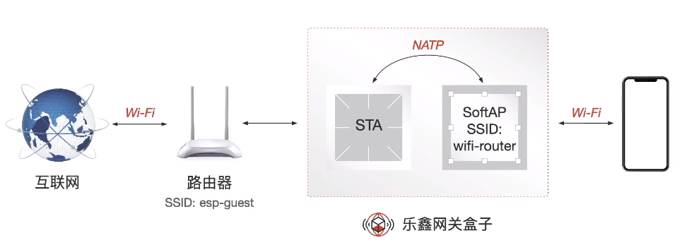
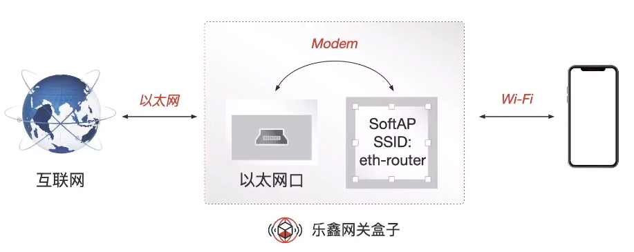
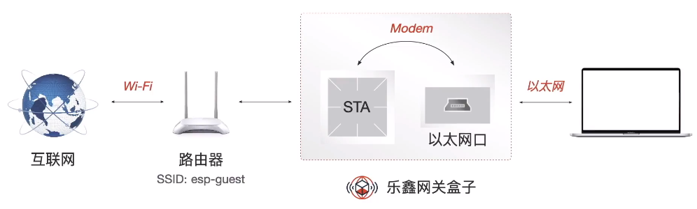
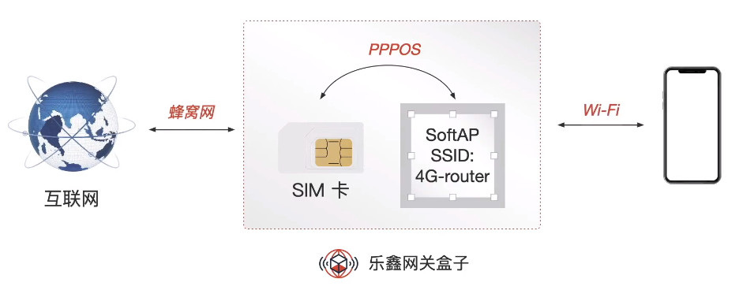
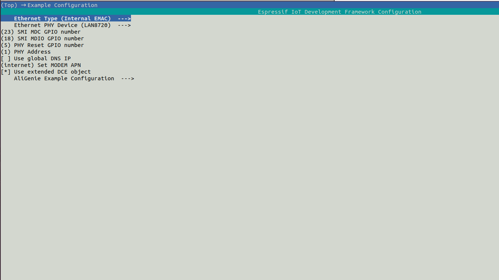
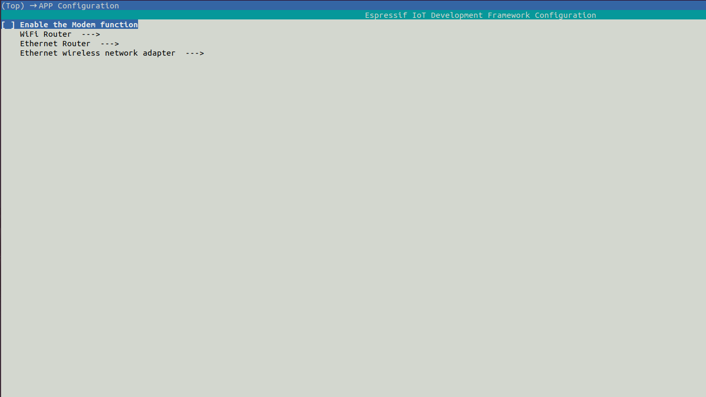

# ESP-Gateway 智能网关方案

本文档将介绍 ESP-Gateway 智能网关方案的配置流程和使用方法


# 目录

- [1.概述](#1)
- [2.硬件准备](#2)
- [3.环境搭建](#3)
- [4.SDK 准备](#4)
- [5.配置项介绍](#5)
- [6.编译 && 烧写 && 运行](#6)
- [7.使用方法](#7)
- [8.方案优势](#8)


## <span id = "1">1.概述</span>

乐鑫 ESP-Gateway 智能网关方案基于 ESP32 设计开发，目前已实现 **Wi-Fi 路由器**、**以太网路由器**、**以太网无线网卡**、**随身 Wi-Fi** 四大功能，最大程度发挥了乐鑫芯片的网络优势。

#### 1.1 Wi-Fi 路由器

ESP-Gateway 设备无线连接路由器后开启热点，周围的智能设备连接其热点后即可联网。



#### 1.2 以太网路由器

ESP-Gateway 设备通过网线接入网口后开启热点，周围的智能设备连接其热点后即可联网，同时，ESP-Gateway 设备会被分配属于自己的 IP 地址，故用户可通过连接至该局域网的智能设备与 ESP-Gateway 设备进行 TCP 通信。



#### 1.3 以太网无线网卡

ESP-Gateway 设备通过路由器联网后，从网线接口引出网线插入至具有 LAN 口的智能设备上，被连接的智能设备即可联网。



#### 1.4 随身 Wi-Fi

ESP-Gateway 设备可搭载插有 SIM 卡的移动网络模块，将蜂窝网络转换为 Wi-Fi 信号，周围的智能设备连接其开启的热点后即可联网。




## <span id = "2">2.硬件准备</span>

- **linux 环境**

用来编译 & 烧写 & 运行等操作的必须环境。

> windows 用户可安装虚拟机，在虚拟机中安装 linux。

- **ESP 设备**

ESP 设备包括 ESP芯片，ESP模组，ESP开发板等。

> **以太网路由器**、**以太网无线网卡** 功能需要额外增加一个以太网 PHY 芯片
>
> **随身Wi-Fi** 功能需要额外增加一个插有 SIM 卡的移动网络模块
>
> 建议使用已经集成 PHY 以太网芯片的 ESP32-Ethernet-Kit 开发板

- **USB 线**

连接 PC 和 ESP 设备，用来烧写/下载程序，查看 log 等。


## <span id = "3">3.环境搭建</span>

**如果您熟悉 ESP 开发环境，可以很顺利理解下面步骤; 如果您不熟悉某个部分，比如编译，烧录，需要您结合官方的相关文档来理解。如您需阅读 [ESP-IDF 编程指南](https://docs.espressif.com/projects/esp-idf/zh_CN/latest/index.html)文档等。**

### 3.1 编译器环境搭建

- 根据[官方链接](https://github.com/espressif/esp-idf/blob/master/docs/zh_CN/get-started/linux-setup.rst)中 **工具链的设置**，下载 toolchain
- toolchain 设置参考 [ESP-IDF 编程指南](https://docs.espressif.com/projects/esp-idf/zh_CN/latest/get-started/index.html#get-started-setup-toolchain)。

### 3.2 烧录工具/下载工具获取

- 烧录工具位于 [esp-idf](https://github.com/espressif/esp-idf) 下 `./components/esptool_py/esptool/esptool.py`
- esptool 功能参考:

```
$ ./components/esptool_py/esptool/esptool.py --help
```


## <span id = "4">4.SDK 准备</span>

- 获取 Espressif SDK [ESP-IDF](https://github.com/espressif/esp-idf)
- 为确保成功获取了完整的 ESP-IDF，请在终端中输入 `idf.py --version`，如果输出结果类似于 `ESP-IDF v4.4-dev-3675-g35b20cadce`，则代表安装成功。详细的安装和配置说明请参考[快速入门文档](https://docs.espressif.com/projects/esp-idf/zh_CN/latest/esp32s2/get-started/index.html)。
- 成功获取到 ESP-IDF 之后，请将 ESP-IDF 版本切换到 `release/v4.4`  分支。


## <span id = "5">5.配置项介绍</span>

**Example Configuration 目录**

- 根据硬件所需选择合适的 Ethernet Type 和 Ethernet PHY Device
- MODEM APN 和 extended DCE object 为 esp-modem 组件的配置选项




**APP Configuration 目录**

- Modem function 即随身 Wi-Fi 功能，默认关闭
- Wi-Fi Router 即 Wi-Fi 路由器功能，进入目录可分别配置设备 STA 和 AP 的 ssid 和 password
- Ethernet Router 即以太网路由器功能，进入目录可配置设备所起 AP 的 ssid 和 password
- Ethernet wireless network adapter 即以太网无线网卡功能，进入目录可配置设备所要连接 AP 的 ssid 和 password




## <span id = "6">6.编译 && 烧写 && 运行</span>

### 6.1 编译

#### 6.1.1 导出编译器

参考 [工具链的设置](https://docs.espressif.com/projects/esp-idf/zh_CN/latest/get-started/linux-setup.html)

#### 6.1.2 编译 demo 示例

在 esp-gateway 目录下执行：
```
idf.py menuconfig
```
根据 [5.配置项介绍](#config) 选择合适的配置选项，配置完成之后执行以下命令生成最终 bin
```
idf.py build
```

### 6.2 擦除 & 编译烧写 & 下载固件 & 查看 log

将 USB 线连接好 ESP 设备和 PC,确保烧写端口正确。

#### 6.2.1 烧录程序

```
idf.py flash
```

#### 6.2.3 运行

```
idf.py monitor
```

>也可执行组合命令 `idf.py build flash monitor` 来执行编译、烧录、查看监视器


## <span id = "7">7.使用方法</span>

待程序固件烧录至开发板后，用户可以通过按键来进行功能的切换

| 按键 GPIO 端口        | 短按按键     | 长按按键 3s                    |
| --------------------- | ------------ | ------------------------------ |
| app_main.c 文件中定义 | 选择功能模式 | 重启系统，切换至选择的功能模式 |

每个功能对应一个 led 指示灯，用户可以根据指示灯来判断目前处在的功能模式，led GPIO 端口可以在 app_main.c 中根据用户开发板硬件配置进行设置。

### 7.1 Wi-Fi 路由器

- ESP-Gateway 设备根据 menuconfig 里配置好的信息，连接至无线路由器，同时开启热点
- 智能设备连接至该热点后即可联网
- 该模式下理论传输速率可以达到 10 Mbps，支持 10 个设备同时连接

### 7.2 以太网路由器

- ESP-Gateway 设备通过网线接入路由器 LAN 口，同时开启热点
- 智能设备连接至该热点后即可联网
- 除了上网功能，用户还可以通过连接至该局域网的智能设备与 ESP-Gateway 设备进行 TCP 通信，支持二次开发
- 该模式下理论传输速率可以达到 50 Mbps，支持 10 个设备同时连接

### 7.3 以太网无线网卡

- ESP-Gateway 设备通过无线路由器联网，并通过网口将网线引出
- 笔记本电脑或者台式机等设备可通过在 LAN 口插入该网线即可联网

### 7.4 随身 Wi-Fi

- ESP-Gateway 设备可搭载插有 SIM 卡的移动网络模块（LTE 模块、5G 模块、NB-IoT 模块），将蜂窝网络转换为 Wi-Fi 信号
- ESP-Gateway 设备开启热点，智能设备连接至该热点后即可联网
- 因移动网络模块为外置模块，本项目工程中默认关闭随身 Wi-Fi 的功能，用户在需要该功能时，打开 menuconfig 中相应的选项即可

>具体演示视频请参考 [ESP-Gateway 视频演示](https://www.bilibili.com/video/BV1wo4y1R7NG)


## <span id = "8">8.方案优势</span>

| 功能模式       | 优势                                                                                                                |
| ------------- | ----------------------------------------------------------------------------------------------------------------   |
| Wi-Fi 路由器   | 可作为 Wi-Fi 中继或 Wi-Fi 信号放大器、有效减轻实际路由器的承载力，同时扩大无线覆盖范围                                         |
| 以太网路由器    | 可以减少实际使用的路由器数量、部署成本低                                                                                 |
| 以太网无线网卡  | 免驱动、支持用户在任意位置部署需要通过网线联网的电脑                                                                        |
| 随身 Wi-Fi    | 无需配网、移动性强、应用于共享场景中（共享按摩椅、共享充电宝），仅需一台共享设备搭载移动网络模块，其他设备连接其热点即可联网，大大节约成本 |
