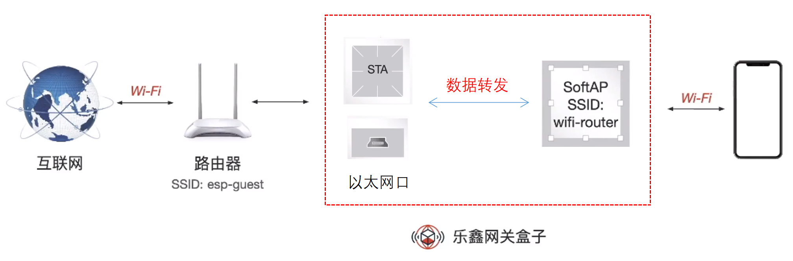
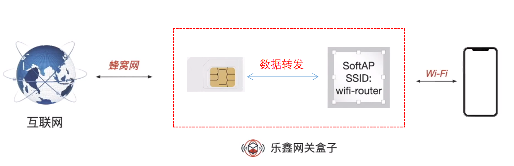
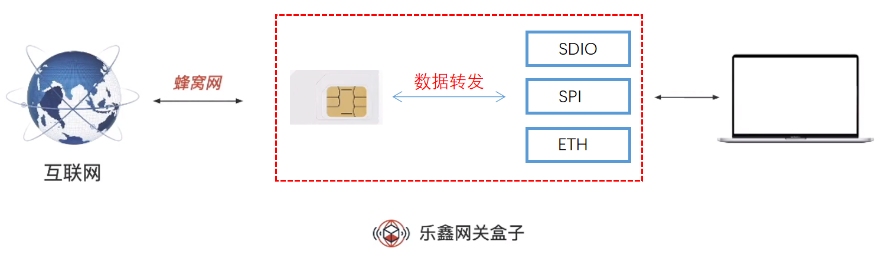
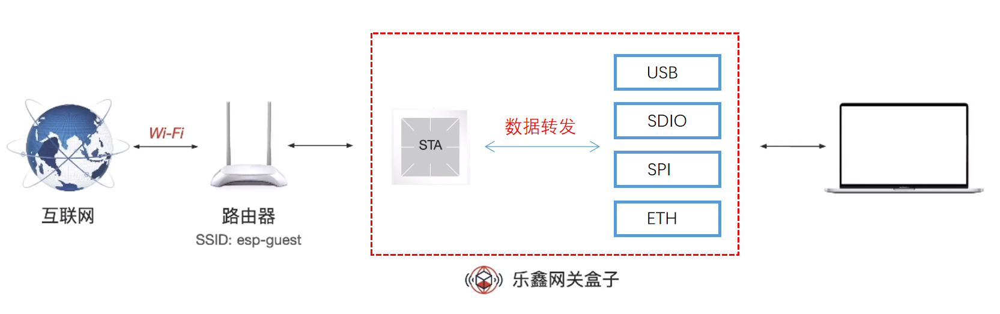
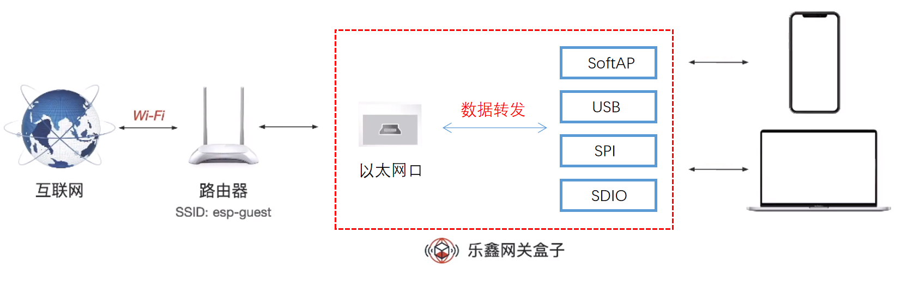

# ESP-IOT-Bridge 智能网关方案

- [English Version](README.md)

ESP-IOT-Bridge 智能网关方案主要针对 iot 应用场景下的各种网络接口之间的桥接，如 SPI、SDIO、USB、Wi-Fi、以太网等网络接口之间的相互桥接，本文档将介绍 ESP-IOT-Bridge 智能网关方案的配置流程和使用方法（该方案原名为 ESP-Gateway，因为本方案不涉及到协议的代理转换，仅仅为数据的转发，所以更改为 ESP-IOT-Bridge）。

# 目录

- [1. 概述](#1)
- [2. 硬件准备](#2)
- [3. 环境搭建](#3)
- [4. SDK 准备](#4)
- [5. 配置项介绍](#5)
- [6. 编译 & 烧录 & 监视输出](#6)
- [7. 配网](#7)
- [8. 方案优势](#8)
- [9. GPIO Map](#9)

## <span id = "1">1. 概述</span>

乐鑫 ESP-IOT-Bridge 智能网关方案已经适配乐鑫多种芯片：

| 芯片     | ESP-IDF Release/v4.4                                         | ESP-IDF Release/v5.0                                         |
| -------- | ------------------------------------------------------------ | ------------------------------------------------------------ |
| ESP32    | [](https://camo.githubusercontent.com/bd5f5f82b920744ff961517942e99a46699fee58737cd9b31bf56e5ca41b781b/68747470733a2f2f696d672e736869656c64732e696f2f62616467652f2d737570706f727465642d677265656e) | [](https://camo.githubusercontent.com/bd5f5f82b920744ff961517942e99a46699fee58737cd9b31bf56e5ca41b781b/68747470733a2f2f696d672e736869656c64732e696f2f62616467652f2d737570706f727465642d677265656e) |
| ESP32-C3 | [](https://camo.githubusercontent.com/bd5f5f82b920744ff961517942e99a46699fee58737cd9b31bf56e5ca41b781b/68747470733a2f2f696d672e736869656c64732e696f2f62616467652f2d737570706f727465642d677265656e) | [](https://camo.githubusercontent.com/bd5f5f82b920744ff961517942e99a46699fee58737cd9b31bf56e5ca41b781b/68747470733a2f2f696d672e736869656c64732e696f2f62616467652f2d737570706f727465642d677265656e) |
| ESP32-S2 | [](https://camo.githubusercontent.com/bd5f5f82b920744ff961517942e99a46699fee58737cd9b31bf56e5ca41b781b/68747470733a2f2f696d672e736869656c64732e696f2f62616467652f2d737570706f727465642d677265656e) | [](https://camo.githubusercontent.com/bd5f5f82b920744ff961517942e99a46699fee58737cd9b31bf56e5ca41b781b/68747470733a2f2f696d672e736869656c64732e696f2f62616467652f2d737570706f727465642d677265656e) |
| ESP32-S3 | [](https://camo.githubusercontent.com/bd5f5f82b920744ff961517942e99a46699fee58737cd9b31bf56e5ca41b781b/68747470733a2f2f696d672e736869656c64732e696f2f62616467652f2d737570706f727465642d677265656e) | [](https://camo.githubusercontent.com/bd5f5f82b920744ff961517942e99a46699fee58737cd9b31bf56e5ca41b781b/68747470733a2f2f696d672e736869656c64732e696f2f62616467652f2d737570706f727465642d677265656e) |
| ESP32-H2 | TODO                                                         | TODO                                                         |
| ESP32-C2 | *N/A*                                                        | TODO                                                         |

ESP-IOT-Bridge 方案提供多个网络接口，不同的网络接口可以分为两大类：

- 用于连接互联网的接口

- 用于帮助其他设备转发网络数据使其联网的接口

用户可以通过多种不同的网络接口组合来实现个性化的智能网关方案，最大程度地发挥乐鑫芯片的网络优势。


根据接口的不同组合可以实现多种功能，如下表：

|                    | 无线热点     | 以太网接口 | USB 接口 | SPI 接口 | SDIO 接口 | Bluetooth LE 接口 | Thread 接口          |
| ------------------ | ------------ | ---------- | -------- | -------- | --------- | -------- | -------------------- |
| **无线 Wi-Fi**     | Wi-Fi 路由器 | 无线网卡   | 无线网卡 | 无线网卡 | 无线网卡  | Bluetooth LE 网关 | Thread 边界路由器 |
| **以太网**         | Wi-Fi 路由器 | 不支持     | 有线网卡 | 有线网卡 | 有线网卡  | Bluetooth LE 网关 | Thread 边界路由器 |
| **Cat.1 4G (UART)** | 4G 热点      | 4G 网卡    | 4G 网卡  | 4G 网卡  | 4G 网卡   | Bluetooth LE 网关 | Thread 边界路由器 |
| **Cat.1 4G (USB)**  | 4G 热点      | 4G 网卡    | 不支持   | 4G 网卡  | 4G 网卡   | Bluetooth LE 网关 | Thread 边界路由器 |

备注：

- **第一列的无线 Wi-Fi、以太网、Cat.1 4G (UART)、以及 Cat.1 4G (USB) 是连接到互联网的接口。**

- **第一行的无线热点、以太网接口、USB 接口、SPI 接口、SDIO 接口、Bluetooth LE 接口、以及 Thread 接口是为其它设备提供上网功能的接入接口。**


可以总结出上表主要涉及以下几种应用场景：Wi-Fi 路由器、4G 热点、4G 网卡、无线网卡、有线网卡、Bluetooth LE 网关和 Thread 边界路由器。ESP 芯片对这些场景的支持情况如下表所示：

| ESP 设备 | Wi-Fi 路由器                                                 | 4G 热点                                                      | 4G 网卡                                                      | 无线网卡                                                     | 有线网卡                                                     | Bluetooth LE 网关 | Thread 边界路由器 |
| -------- | ------------------------------------------------------------ | ------------------------------------------------------------ | ------------------------------------------------------------ | ------------------------------------------------------------ | ------------------------------------------------------------ | -------- | -------------------- |
| ESP32    | [](https://camo.githubusercontent.com/bd5f5f82b920744ff961517942e99a46699fee58737cd9b31bf56e5ca41b781b/68747470733a2f2f696d672e736869656c64732e696f2f62616467652f2d737570706f727465642d677265656e) | [](https://camo.githubusercontent.com/bd5f5f82b920744ff961517942e99a46699fee58737cd9b31bf56e5ca41b781b/68747470733a2f2f696d672e736869656c64732e696f2f62616467652f2d737570706f727465642d677265656e) | [](https://camo.githubusercontent.com/bd5f5f82b920744ff961517942e99a46699fee58737cd9b31bf56e5ca41b781b/68747470733a2f2f696d672e736869656c64732e696f2f62616467652f2d737570706f727465642d677265656e)(ETH/SDIO/SPI) | [](https://camo.githubusercontent.com/bd5f5f82b920744ff961517942e99a46699fee58737cd9b31bf56e5ca41b781b/68747470733a2f2f696d672e736869656c64732e696f2f62616467652f2d737570706f727465642d677265656e)(ETH/SDIO/SPI) | [](https://camo.githubusercontent.com/bd5f5f82b920744ff961517942e99a46699fee58737cd9b31bf56e5ca41b781b/68747470733a2f2f696d672e736869656c64732e696f2f62616467652f2d737570706f727465642d677265656e)(SDIO/SPI) | TODO     | TODO                 |
| ESP32-C3 | [](https://camo.githubusercontent.com/bd5f5f82b920744ff961517942e99a46699fee58737cd9b31bf56e5ca41b781b/68747470733a2f2f696d672e736869656c64732e696f2f62616467652f2d737570706f727465642d677265656e) | [](https://camo.githubusercontent.com/454168caab8b950c543c742ed575f11641ae9eb80be0ad511df3cb1c1b783baa/68747470733a2f2f696d672e736869656c64732e696f2f62616467652f2d707265766965772d6f72616e6765) | [](https://camo.githubusercontent.com/bd5f5f82b920744ff961517942e99a46699fee58737cd9b31bf56e5ca41b781b/68747470733a2f2f696d672e736869656c64732e696f2f62616467652f2d737570706f727465642d677265656e)(ETH/SPI) | [](https://camo.githubusercontent.com/bd5f5f82b920744ff961517942e99a46699fee58737cd9b31bf56e5ca41b781b/68747470733a2f2f696d672e736869656c64732e696f2f62616467652f2d737570706f727465642d677265656e)(ETH/SPI) | [](https://camo.githubusercontent.com/bd5f5f82b920744ff961517942e99a46699fee58737cd9b31bf56e5ca41b781b/68747470733a2f2f696d672e736869656c64732e696f2f62616467652f2d737570706f727465642d677265656e)(SPI) | TODO     | TODO                 |
| ESP32-S2 | [](https://camo.githubusercontent.com/bd5f5f82b920744ff961517942e99a46699fee58737cd9b31bf56e5ca41b781b/68747470733a2f2f696d672e736869656c64732e696f2f62616467652f2d737570706f727465642d677265656e) | [](https://camo.githubusercontent.com/bd5f5f82b920744ff961517942e99a46699fee58737cd9b31bf56e5ca41b781b/68747470733a2f2f696d672e736869656c64732e696f2f62616467652f2d737570706f727465642d677265656e) | [](https://camo.githubusercontent.com/bd5f5f82b920744ff961517942e99a46699fee58737cd9b31bf56e5ca41b781b/68747470733a2f2f696d672e736869656c64732e696f2f62616467652f2d737570706f727465642d677265656e)(ETH/SPI) | [](https://camo.githubusercontent.com/bd5f5f82b920744ff961517942e99a46699fee58737cd9b31bf56e5ca41b781b/68747470733a2f2f696d672e736869656c64732e696f2f62616467652f2d737570706f727465642d677265656e)(USB/ETH/SPI) | [](https://camo.githubusercontent.com/bd5f5f82b920744ff961517942e99a46699fee58737cd9b31bf56e5ca41b781b/68747470733a2f2f696d672e736869656c64732e696f2f62616467652f2d737570706f727465642d677265656e)(USB/SPI) | *N/A* | TODO                 |
| ESP32-S3 | [](https://camo.githubusercontent.com/bd5f5f82b920744ff961517942e99a46699fee58737cd9b31bf56e5ca41b781b/68747470733a2f2f696d672e736869656c64732e696f2f62616467652f2d737570706f727465642d677265656e) | [](https://camo.githubusercontent.com/bd5f5f82b920744ff961517942e99a46699fee58737cd9b31bf56e5ca41b781b/68747470733a2f2f696d672e736869656c64732e696f2f62616467652f2d737570706f727465642d677265656e) | [](https://camo.githubusercontent.com/bd5f5f82b920744ff961517942e99a46699fee58737cd9b31bf56e5ca41b781b/68747470733a2f2f696d672e736869656c64732e696f2f62616467652f2d737570706f727465642d677265656e)(ETH/SPI) | [](https://camo.githubusercontent.com/bd5f5f82b920744ff961517942e99a46699fee58737cd9b31bf56e5ca41b781b/68747470733a2f2f696d672e736869656c64732e696f2f62616467652f2d737570706f727465642d677265656e)(USB/ETH/SPI) | [](https://camo.githubusercontent.com/bd5f5f82b920744ff961517942e99a46699fee58737cd9b31bf56e5ca41b781b/68747470733a2f2f696d672e736869656c64732e696f2f62616467652f2d737570706f727465642d677265656e)(USB/SPI) | TODO     | TODO                 |
| ESP32-H2 | TODO                                                         | TODO                                                         | TODO                                                         | TODO                                                         | TODO                                                         | TODO     | TODO                 |

备注：

- **ESP32 没有 USB 接口，ESP32-C3 的 USB 接口无法用于通讯。如需使用 <font color=red>USB 网卡 </font>或 <font color=red>Cat.1 4G(USB)</font> 功能，请选择 ESP32-S2 或 ESP32-S3。**
- **只有 ESP32 支持以太网接口，其它芯片需要外接 SPI 连接以太网芯片。关于 ESP32 MAC & PHY 配置，请参考 [配置 MAC 和 PHY](https://docs.espressif.com/projects/esp-idf/en/latest/esp32/api-reference/network/esp_eth.html#configure-mac-and-phy)。**
- **使用 Thread 边界路由器时，需要搭配 802.15.4 芯片，如 ESP32-H2。**
- **对于 ESP32 SDIO 接口，硬件上有管脚上拉需求，具体请参考 [SD 上拉需求](https://docs.espressif.com/projects/esp-idf/en/latest/esp32/api-reference/peripherals/sd_pullup_requirements.html)。**


### 1.1 Wi-Fi 路由器

ESP-IOT-Bridge 设备通过 Wi-Fi 或者有线以太网网口连接至路由器，智能设备通过连接至 ESP-IOT-Bridge 设备的 SoftAP 热点进行上网。

- 通过在 menuconfig（``Bridge Configuration`` > ``SoftAP Config``）中启用 ``ESP_BRIDGE_SOFTAP_SSID_END_WITH_THE_MAC``，可在 SoftAP SSID 末尾增加 MAC 信息。

- 单个 Bridge 设备最多支持 10 个 Station 同时连接，多个 Station 设备共享带宽。

- 若 ESP-IOT-Bridge 设备通过 Wi-Fi 连接至路由器，则需要进行配网操作，目前支持以下两种配网方式：

    > - [网页配网](#web)
    > - [Wi-Fi Provisioning (Bluetooth LE) 配网](#wifi_provisioning)（不支持 ESP32-S2）



### 1.2 4G 热点

ESP-IOT-Bridge 设备在搭载插有 SIM 卡的移动网络模块后可将蜂窝网络转换为 Wi-Fi 信号，周围的智能设备连接其开启的热点后即可联网。

以下模块已适配 **4G Cat.1**：

| UART      | USB             |
| --------- | --------------- |
| A7670C    | ML302-DNLM/CNLM |
| EC600N-CN | Air724UG-NFM    |
| SIM76000  | EC600N-CNLA-N05 |
|           | EC600N-CNLC-N06 |
|           | SIMCom A7600C1  |



### 1.3 4G 网卡

ESP-IOT-Bridge 设备可搭载插有 SIM 卡的移动网络模块，网络模块联网后，可通过多个网络接口（ETH/SDIO/SPI）接入 PC 或 MCU，为设备提供上网能力。



<font color=red>**⚠️Note**</font>：

> 如需使用 4G 网卡方案，请联系 sales@espressif.com 获取源码或固件。

### 1.4 无线网卡

ESP-IOT-Bridge 设备可通过多个网络接口（USB/ETH/SDIO/SPI）接入 PC 或 MCU，在连接成功后，PC 或 MCU 等设备会新增一个网卡。待配网成功后，即可为设备提供上网能力。

- USB 线一端连接至 ESP32-S2/ESP32-S2S3 的 GPIO19/20，一端连接至 MCU

    |             | USB_DP | USB_DM |
    | ----------- | ------ | ------ |
    | ESP32-S2/S3 | GPIO20 | GPIO19 |

- 使用 SPI/SDIO 接口需要对 MCU(Host) 侧进行配置。具体依赖项设置引导，请参考 **[Linux_based_readme](./doc/Linux_based_readme.md)**。

- 关于 SDIO 硬件连线和 MCU(Host) 配置，请参考 **[SDIO_setup](./doc/SDIO_setup.md)**。

- 关于 SPI 硬件连线和 MCU(Host) 配置，请参考 **[SPI_setup](./doc/SPI_setup.md)**。

- 该方案需要进行配网操作，目前支持以下两种配网方式:

    > - [网页配网](#web)
    > - [Wi-Fi Provisioning (Bluetooth LE) 配网](#wifi_provisioning)（不支持 ESP32-S2）



<font color=red>**⚠️Note**</font>：

> 如需使用无线网卡方案，请联系 sales@espressif.com 获取源码或固件。

### 1.5 有线网卡

ESP-IOT-Bridge 设备可通过将以太网网线插入路由器 LAN 口连接网络，并通过多个网络接口（USB/SDIO/SPI）接入 PC 或 MCU，为设备提供上网能力。

- USB 线一端连接至 ESP32-S2/ESP32-S3 的 GPIO19/20，一端连接至 MCU

    |             | USB_DP | USB_DM |
    | ----------- | ------ | ------ |
    | ESP32-S2/S3 | GPIO20 | GPIO19 |

- 使用 SPI/SDIO 接口需要对 MCU(Host) 侧进行配置，具体依赖项设置引导，请参考 **[Linux_based_readme](./doc/Linux_based_readme.md)**。

- 关于 SDIO 硬件连线和 MCU(Host) 配置，请参考 **[SDIO_setup](./doc/SDIO_setup.md)**。

- 关于 SPI 硬件连线和 MCU(Host) 配置，请参考 **[SPI_setup](./doc/SPI_setup.md)**。



⚠️<font color=red>**Note:** </font>

> 如需使用有线网卡方案，请联系 sales@espressif.com 获取源码或固件。

## <span id = "2">2. 硬件准备</span>

- **Linux 环境**

Linux 环境是用于执行编译、烧写、运行等操作的必须环境。

> Windows 用户可安装虚拟机，在虚拟机中安装 Linux。

- **ESP 设备**

ESP 设备包括 ESP 芯片，ESP 模组，ESP 开发板等。

> - 对于**以太网路由器**、**以太网无线网卡**功能：
>     - ESP32 需要额外增加一个以太网 PHY 芯片
>     - 其它 ESP 芯片需要 SPI 转以太网芯片
> - 对于**随身 Wi-Fi** 功能，需要额外增加一个插有 SIM 卡的移动网络模块。

- **USB 线**

USB 线主要是用于连接 PC 和 ESP 设备、烧写/下载程序以及查看 log 等。


## <span id = "3">3. 环境搭建</span>

**如果您熟悉 ESP 开发环境，则可以很轻松理解下面步骤; 如果您不熟悉某个部分，比如编译或烧录，请参考官方文档 [ESP-IDF 编程指南](https://docs.espressif.com/projects/esp-idf/zh_CN/latest/index.html)。**


### 3.1 下载和设置工具链

请参考 [Linux 平台工具链的标准设置](https://docs.espressif.com/projects/esp-idf/zh_CN/latest/esp32/get-started/linux-macos-setup.html) 下载和设置工具链，用于项目编译。

### 3.2 烧录工具/下载工具获取

- 烧录工具位于 [esp-idf](https://github.com/espressif/esp-idf) 的 `./components/esptool_py/esptool/esptool.py` 中

- esptool 功能参考:

```
$ ./components/esptool_py/esptool/esptool.py --help
```

### 3.3 ESP-IOT-Bridge 仓库获取

```
$ git clone --recursive https://github.com/espressif/esp-iot-bridge.git
```

## <span id = "4">4. SDK 准备</span>

- 获取 Espressif SDK [ESP-IDF](https://github.com/espressif/esp-idf)。

- 为确保成功获取了完整的 ESP-IDF，请在终端中输入 `idf.py --version`，如果输出结果类似于 `ESP-IDF v4.4-dev-3675-g35b20cadce`，则代表安装成功。详细的安装和配置说明请参考[快速入门文档](https://docs.espressif.com/projects/esp-idf/zh_CN/latest/esp32s2/get-started/index.html)。

- 成功获取到 ESP-IDF 之后，请将 ESP-IDF 版本切换到 `release/v4.4`  分支。

- 给 ESP-IDF 打上 Patch，详情请参考 [Patch for ESP-IDF](./idf_patch/README.md)


## <span id = "5">5. 配置项</span>

**选择连接外部网络的接口**


**选择为其它设备提供网络数据转发的接口**


- 用户可选择不同的接口组合来实现相应的功能。

- 是否支持选择多个网络数据转发接口来给不同设备提供网络功能？

    | IDF Version          |          | 备注                            |
    | -------------------- | -------- | ------------------------------- |
    | ESP-IDF Release/v4.4 | 不支持    | 只能选择一个网络数据转发接口    |
    | ESP-IDF Release/v5.0 | **支持** | 目前不能同时选择 SDIO 和 SPI 接口 |

    ```
                                 +-- USB  <-+->  Computer
                                 |
    RasPi + ethsta0 +-- SPI -- ESP32 --> External WiFi（Router）
                                 |
                                 +-- SoftAP <-+-> Phone
    ```

**ETH 配置项**


**Modem 配置项**


## <span id = "6">6. 编译 & 烧写 & 监视输出</span>

### 6.1 编译

在 esp-iot-bridge 目录下执行：

```
$ idf.py menuconfig
```

根据 [5.配置项](#5) 选择合适的配置选项，配置完成之后执行以下命令生成 bin。

```
$ idf.py build
```

### 6.2 烧录程序 & 监视输出

使用 USB 线连接 ESP 设备和 PC，确保烧写端口正确。

#### 6.2.1 烧录程序

```
$ idf.py flash
```

#### 6.2.3 监视输出

```
$ idf.py monitor
```

> 也可使用组合命令 `idf.py build flash monitor` 一次性执行构建、烧录和监视过程。

## <span id = "7">7. 配网</span>

### <span id = "web">7.1 网页配网</span>

PC 或 MCU 连接至 ESP-IOT-Bridge 设备热点并成功获取到 IP 地址后，可以通过访问网关 IP 来进行网页配网。


### <span id = "wifi_provisioning">7.2 Wi-Fi Provisioning (Bluetooth LE) 配网</span>

#### 7.2.1 获取 APP

- Android:
    - [Bluetooth LE Provisioning app on Play Store](https://play.google.com/store/apps/details?id=com.espressif.provble).
    - GitHub 中源码: [esp-idf-provisioning-android](https://github.com/espressif/esp-idf-provisioning-android).
- iOS:
    - [Bluetooth LE Provisioning app on app store](https://apps.apple.com/in/app/esp-ble-provisioning/id1473590141)
    - GitHub 中源码: [esp-idf-provisioning-ios](https://github.com/espressif/esp-idf-provisioning-ios)

#### 7.2.2 扫描二维码

扫描如 log 显示的二维码进行配网操作

```
I (1604) QRCODE: {"ver":"v1","name":"PROV_806314","pop":"abcd1234","transport":"ble"}
I (1607) NimBLE: GAP procedure initiated: advertise;
I (1618) NimBLE: disc_mode=2
I (1622) NimBLE:  adv_channel_map=0 own_addr_type=0 adv_filter_policy=0 adv_itvl_min=256 adv_itvl_max=256
I (1632) NimBLE:


  █▀▀▀▀▀█ ▄█ ▄▄ █▄▀ ▀▀█▀█▀█ █▀▀▀▀▀█
  █ ███ █ ▄█▀█ ▄ ▄▄▄█▀ ▀  ▀ █ ███ █
  █ ▀▀▀ █ ▄ █ ▀▄ ▄█ ▄▀▀▀▀▀█ █ ▀▀▀ █
  ▀▀▀▀▀▀▀ ▀ ▀ █ ▀ █ ▀▄▀▄█ █ ▀▀▀▀▀▀▀
  ▀▀█▀█ ▀█▀█▀ ▀█▄ ▄▀▀▄▄▄▄█▄▀▄▀ ▀▄█▄
  ██▀▄ █▀▄██▄█▀▀ █ ▀█ ▀█▄▄ █▀▄  ▄█
  ▀ █   ▀▀ ▀▄▀▄▀ ▀█▀▀▄▄▄▄▀ ▀▄▀▀ ▄▀▄
  ▀▀█▄█▀▀▀▀▀▄ ▄▀ ▀▀▀▀▄ █▀▄▀█ ▀█ ▄▀▄
  ▀▀▄▄ █▀ ▀█▄ ▀▀▀▀█▀▀▄ ▄    ▄▀▀▀ █▄
  ▄▄█▄▄ ▀█  ▀█▀▀ ▀▄ ▄▄ ▄ ▄  ▄█▀ ▄▀▄
  ▄▀▀█▀ ▀  █▀▀▄█▀ ▄▀██▀  ▀▀▄▄█▀ ▄ ▄
  █  ▄▄█▀▄▄█  ▄ ▀█▀▀█▄ █▀▄█ █▀▄▄▄▄▄
  ▀ ▀▀  ▀▀▄▄█ ▀▀▀▀▄██▄ ▄ ▄█▀▀▀██▄▄█
  █▀▀▀▀▀█ ▀ ██▀ █▀  ▄  ▄ ▄█ ▀ █ ▄▀
  █ ███ █ █▀█▀█▀ ▀█▀█▄█▄█ █▀▀██▀▄▀
  █ ▀▀▀ █ █▀▄  ▀ █▄▀█▄██ ▄█ ▀█▄▀█▀
  ▀▀▀▀▀▀▀ ▀▀ ▀ ▀▀▀▀▀ ▀  ▀▀▀ ▀▀   ▀


I (1798) esp_bridge_wifi_prov_mgr: If QR code is not visible, copy paste the below URL in a browser.
https://espressif.github.io/esp-jumpstart/qrcode.html?data={"ver":"v1","name":"PROV_806314","pop":"abcd1234","transport":"ble"}
```

<font color=red>**⚠️Note**</font>：

由于 ESP32-S2 不支持 BLE，故该配网方案不适用于 ESP32-S2

## <span id = "8">8. 方案优势</span>

| 功能模式       | 优势                                                                                                                |
| ------------- | ----------------------------------------------------------------------------------------------------------------   |
| Wi-Fi 路由器（Station） | 可作为 Wi-Fi 中继或 Wi-Fi 信号放大器、有效减轻实际路由器的承载力，同时扩大无线覆盖范围                                         |
| Wi-Fi 路由器（ETH） | 可以减少实际使用的路由器数量、部署成本低                                                                                 |
| 4G 热点 | 无需配网、移动性强、应用于共享场景中（如共享按摩椅、共享充电宝等）；仅需一台共享设备搭载移动网络模块，其他设备连接其热点即可联网，大大节约成本 |
| 无线网卡（ETH） | 免驱动、支持用户在任意位置部署需要通过网线联网的 MCU                                                                     |
| 无线网卡（USB） | 免驱动、可热插拔、使用简便，开发成本低 |
| 无线网卡（SPI/SDIO） | 传输速率高 |

**请参考 [ESP-IOT-Bridge 视频](https://www.bilibili.com/video/BV1wo4y1R7NG)，该视频演示了 ESP-IOT-Bridge 的部分功能。**

## <span id = "9">9.GPIO Map</span>

