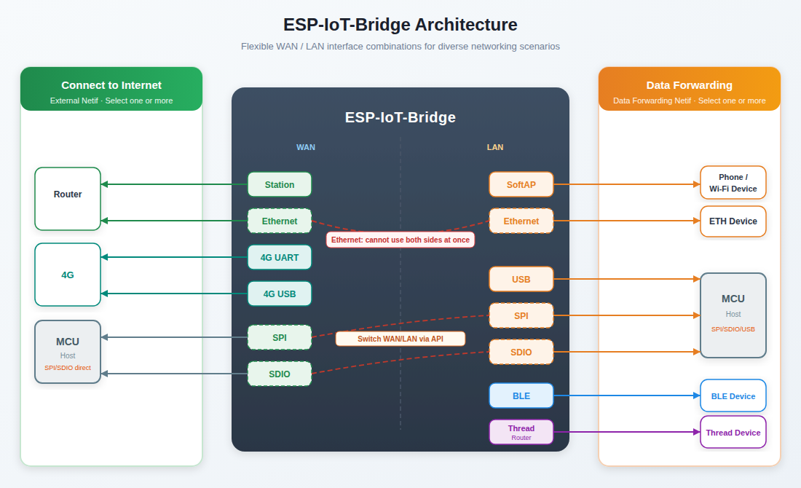
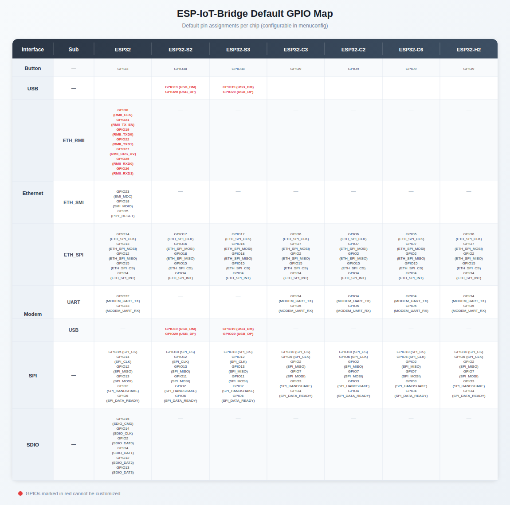

- [中文版](./User_Guide_CN.md)

# ESP-IoT-Bridge Solution

This document describes how to configure and use ESP-IoT-Bridge.

ESP-IoT-Bridge solution focuses on connectivity and communication between various network interfaces in IoT application scenarios, such as SPI, SDIO, USB, Wi-Fi, Ethernet and other network interfaces. In this solution, the bridge device can not only provide net access for other devices, but also be a separate equipment to connect the remote server.


# Table of Contents

- [1 Overview](#1-overview)
- [2 Hardware](#2-hardware)
- [3 Development Environment](#3-set-up-development-environment)
- [4 SDK](#4-get-sdk)
- [5 Configuration](#5-configuration)
- [6 Build Flash Monitor](#6-build-flash-monitor)
- [7 Network Configuration](#7-network-configuration)
- [8 OTA](#8-ota)
- [9 Solution Highlights](#9-solution-highlights)
- [10 GPIO Map](#10-gpio-map)

## 1 Overview

ESP-IoT-Bridge is supported by various Espressif chips, as shown in the table below:

| Chip     |  ESP-IDF Release/v5.2  |  ESP-IDF Release/v5.3  |  ESP-IDF Release/v5.4  |  ESP-IDF Release/v5.5  |  ESP-IDF Release/v6.0  |  ESP-IDF Release/v6.1  |
| :------- | :--------------------: | :--------------------: | :--------------------: | :--------------------: | :--------------------: | :--------------------: |
| ESP32    | ![alt text][supported] | ![alt text][supported] | ![alt text][supported] | ![alt text][supported] | ![alt text][supported] | ![alt text][supported] |
| ESP32-C3 | ![alt text][supported] | ![alt text][supported] | ![alt text][supported] | ![alt text][supported] | ![alt text][supported] | ![alt text][supported] |
| ESP32-S2 | ![alt text][supported] | ![alt text][supported] | ![alt text][supported] | ![alt text][supported] | ![alt text][supported] | ![alt text][supported] |
| ESP32-S3 | ![alt text][supported] | ![alt text][supported] | ![alt text][supported] | ![alt text][supported] | ![alt text][supported] | ![alt text][supported] |
| ESP32-C2 | ![alt text][supported] | ![alt text][supported] | ![alt text][supported] | ![alt text][supported] | ![alt text][supported] | ![alt text][supported] |
| ESP32-C6 | ![alt text][supported] | ![alt text][supported] | ![alt text][supported] | ![alt text][supported] | ![alt text][supported] | ![alt text][supported] |
| ESP32-C5 |                        |                        | ![alt text][supported] | ![alt text][supported] | ![alt text][supported] | ![alt text][supported] |
| ESP32-C61|                        |                        | ![alt text][supported] | ![alt text][supported] | ![alt text][supported] | ![alt text][supported] |

[supported]: https://img.shields.io/badge/-supported-green "supported"

The ESP-IoT-Bridge solution provides several network interfaces, which can be divided into two main categories:

- Interfaces for connecting to the Internet

- Interfaces for forwarding network packets for other devices so that they can access the Internet

Users can achieve personalized network interface connection solutions through a variety of different network interface combinations to maximize the network advantages of espressif chips.



A variety of functions can be achieved depending on the combination of interfaces, as shown in the table below:

|                     | SoftAP        | Ethernet Interface | USB Interface | SPI/SDIO | Bluetooth LE Interface | Thread Interface |
| ------------------- | ------------- | ------------------ | ------------- | -------- | ---------------------- | ---------------- |
| **Station**         | Wi-Fi Router  | Wi-Fi Router       | Wireless NIC  | Wireless NIC | Bluetooth LE Border Router | Thread Border Router |
| **Ethernet**        | Wi-Fi Router  | Unsupported        | Wired NIC     | Wired NIC    | Bluetooth LE Border Router | Thread Border Router |
| **SPI/SDIO**        | MCU Wi-Fi Bridge | MCU Ethernet Bridge | MCU USB Bridge | Unsupported | Unsupported          | Unsupported      |
| **Cat.1 4G (UART)** | 4G Router     | 4G Router          | 4G NIC        | 4G NIC       | Bluetooth LE Border Router | Thread Border Router |
| **Cat.1 4G (USB)**  | 4G Router     | 4G Router          | Unsupported   | 4G NIC       | Bluetooth LE Border Router | Thread Border Router |

Notes:

- **Station, Ethernet, Cat.1 4G (UART/USB), and SPI/SDIO in the first column are interfaces for connecting to the Internet.**

- **SoftAP, Ethernet interface, USB interface, SPI/SDIO interface, Bluetooth LE interface, and Thread interface in the first row are the interfaces that provide Internet access to other devices.**

- **In the current version, Ethernet and SPI/SDIO cannot act as both external netif (connecting to an external network) and data forwarding netif (forwarding data for other devices) at the same time.** However, SPI/SDIO can enable both to create separate WAN/LAN netifs, and switch roles at runtime via `esp_bridge_spi_set_netif_type()` / `esp_bridge_sdio_set_netif_type()` (`IOT_BRIDGE_NETIF_WAN` or `IOT_BRIDGE_NETIF_LAN`). Ethernet can also enable ``Ethernet acts as WAN or LAN automatically`` to switch roles based on the network environment.

To summarize, the above table mainly involves the following application scenarios: Wi-Fi Router, 4G Router, 4G NIC, wireless NIC, wired NIC, MCU Wi-Fi Bridge, MCU Ethernet Bridge, MCU USB Bridge, Bluetooth LE Border Router and Thread Border Router. The table below shows what scenarios each specific ESP chip supports:

| ESP Chips | Wi-Fi Router           | 4G Router              | 4G NIC                               | Wireless NIC                         | Wired NIC                            | MCU Wi-Fi Bridge                     | MCU Ethernet Bridge                  | MCU USB Bridge                       | Bluetooth LE Border Router | Thread Border Router |
| --------- | ---------------------- | ---------------------- | ------------------------------------ | ------------------------------------ | ------------------------------------ | ------------------------------------ | ------------------------------------ | ------------------------------------ | -------------------------- | -------------------- |
| ESP32     | ![alt text][supported] | ![alt text][supported] | ![alt text][supported]<br>(SDIO/SPI) | ![alt text][supported]<br>(SDIO/SPI) | ![alt text][supported]<br>(SDIO/SPI) | ![alt text][supported]<br>(SDIO/SPI) | ![alt text][supported]<br>(SDIO/SPI) | *N/A*                                | TODO                       | TODO                 |
| ESP32-C3  | ![alt text][supported] | ![alt text][supported] | ![alt text][supported]<br>(SPI)    | ![alt text][supported]<br>(SPI)      | ![alt text][supported]<br>(SPI)      | ![alt text][supported]<br>(SPI)      | ![alt text][supported]<br>(SPI)      | *N/A*                                | TODO                       | TODO                 |
| ESP32-S2  | ![alt text][supported] | ![alt text][supported] | ![alt text][supported]<br>(SPI)    | ![alt text][supported]<br>(USB/SPI)  | ![alt text][supported]<br>(USB/SPI)  | ![alt text][supported]<br>(USB/SPI)  | ![alt text][supported]<br>(USB/SPI)  | ![alt text][supported]<br>(USB/SPI)  | *N/A*                      | TODO                 |
| ESP32-S3  | ![alt text][supported] | ![alt text][supported] | ![alt text][supported]<br>(SPI)    | ![alt text][supported]<br>(USB/SPI)  | ![alt text][supported]<br>(USB/SPI)  | ![alt text][supported]<br>(USB/SPI)  | ![alt text][supported]<br>(USB/SPI)  | ![alt text][supported]<br>(USB/SPI)  | TODO                       | TODO                 |
| ESP32-C2  | ![alt text][supported] | ![alt text][supported] | ![alt text][supported]<br>(SPI)    | ![alt text][supported]<br>(SPI)      | ![alt text][supported]<br>(SPI)      | ![alt text][supported]<br>(SPI)      | ![alt text][supported]<br>(SPI)      | *N/A*                                | TODO                       | TODO                 |
| ESP32-C6  | ![alt text][supported] | ![alt text][supported] | ![alt text][supported]<br>(SPI)    | ![alt text][supported]<br>(SPI)      | ![alt text][supported]<br>(SPI)      | ![alt text][supported]<br>(SDIO/SPI) | ![alt text][supported]<br>(SDIO/SPI) | *N/A*                                | TODO                       | TODO                 |
| ESP32-C5  | ![alt text][supported] | ![alt text][supported] | ![alt text][supported]<br>(SPI)    | ![alt text][supported]<br>(SPI)      | ![alt text][supported]<br>(SPI)      | ![alt text][supported]<br>(SDIO/SPI) | ![alt text][supported]<br>(SDIO/SPI) | *N/A*                                | TODO                       | TODO                 |
| ESP32-C61 | ![alt text][supported] | ![alt text][supported] | TODO                                 | TODO                                 | TODO                                 | TODO                                 | TODO                                 | *N/A*                                | TODO                       | TODO                 |

Notes:

- **ESP32 doesn't have a USB interface and the USB interface for ESP32-C3 can't be used for application communication. If you need to use <font color=red> USB NIC </font> or <font color=red> Cat.1 4G (USB)</font> function, please choose ESP32-S2 or ESP32-S3.**
- **Only ESP32 supports Ethernet interface. Other chips need to connect with external Ethernet chip over SPI. For ESP32 MAC & PHY configuration, please refer to [Configure MAC and PHY](https://docs.espressif.com/projects/esp-idf/en/latest/esp32/api-reference/network/esp_eth.html#configure-mac-and-phy).**
- **When using the Thread Border Router, an 802.15.4 chip is required, such as ESP32-H2.**
- **For ESP32 SDIO interface, the pin pull-up requirements should be applied to the hardware. For details, please refer to [SD Pull-up Requirements](https://docs.espressif.com/projects/esp-idf/en/latest/esp32/api-reference/peripherals/sd_pullup_requirements.html).**

### Notes

- Current releases require **ESP-IDF ≥5.2** (see `idf_component.yml`). CI validates against release **5.2–5.5** and **6.0–6.1**.
- Starting from **iot_bridge v1.0.0**, USB features require **ESP-IDF v5.1.4 or later**. For systems using **ESP-IDF 5.0-5.1.3**:
    - **Recommended**: Upgrade ESP-IDF to ≥ v5.2.0
    - **Legacy compatibility**: Downgrade iot_bridge to v0.11.9 (the latest esp_tinyusb component does not support RNDIS; use this configuration if RNDIS is required)
        ```yml
        espressif/iot_bridge:
            version: "0.11.9"
        usb_device:
            path: components/usb/usb_device
            git: https://github.com/espressif/esp-iot-bridge.git
            rules:
            - if: "target in [esp32s2, esp32s3]"
            - if: "idf_version < 5.1.4"
        ```
    | Component Version    | ESP-IDF Version       | USB Support | RNDIS Support | Solution                  |
    |----------------------|-----------------------|-------------|---------------|---------------------------|
    | **iot_bridge ≥1.0.0** | **ESP-IDF ≥5.1.4 (incl. 6.1)**   | ✅ Supported | ❌ Unsupported | Use esp_tinyusb component |
    | **iot_bridge ≥1.0.0** | **ESP-IDF 5.0-5.1.3** | ❌ Unsupported | ❌ Unsupported | Upgrade IDF **or** use legacy solution ↓ |
    | **iot_bridge 0.11.9** | **ESP-IDF 5.0+**     | ✅ Supported | ✅ Supported (idf5.0-5.1.3) | <pre>espressif/iot_bridge:<br>  version: "0.11.9"<br>usb_device:<br>  path: components/usb/usb_device<br>  git: https://github.com/espressif/esp-iot-bridge.git<br>  rules:<br>  - if: "target in [esp32s2, esp32s3]"<br>  - if: "idf_version < 5.1.4"</pre> |

### 1.1 Wi-Fi Router

ESP-IoT-Bridge device can connect to the network by connecting to the router via Wi-Fi or by plugging the Ethernet cable into the LAN port of the router. Then other smart devices or PC can connect to the SoftAP hotspot or LAN interface from the ESP-IoT-Bridge to access the Internet.

- By enabling ``BRIDGE_SOFTAP_SSID_END_WITH_THE_MAC`` in menuconfig (``Bridge Configuration`` > ``SoftAP Config``), users can add MAC information at the end of SoftAP SSID.

- Except for the C2, a single device can support up to 15 sub-devices connected simultaneously (refer to [AP Basic Configuration](https://docs.espressif.com/projects/esp-idf/en/latest/esp32/api-guides/wifi-driver/overview.html#ap-basic-configuration) for details on max_connection). Multiple sub-devices share the bandwidth.

- You need to configure your network if the ESP-IoT-Bridge device connects to the router via Wi-Fi. Currently, the following ways are supported:

    > - [Configure the network on web page](#configure-network-on-web-page)
    > - [Configure the network through Wi-Fi Provisioning (Bluetooth LE)](#configure-network-through-wi-fi-provisioning)（ESP32-S2 not supported）


### 1.2 4G Router

ESP-IoT-Bridge device can be equipped with a mobile network module with a SIM card. After the network module is connected to the Internet, the PC or MCU can be connected to it through the Ethernet or SoftAP interface to gain Internet access.

The table below shows modules that are compatible with 4G Cat.1.

| UART      | USB             |
| --------- | --------------- |
| A7670C    | ML302-DNLM/CNLM |
| EC600N-CN | Air724UG-NFM    |
| SIM76000  | EC600N-CNLA-N05 |
|           | EC600N-CNLC-N06 |
|           | SIMCom A7600C1  |


### 1.3 4G NIC

ESP-IoT-Bridge device can be equipped with a mobile network module with a SIM card. After the network module is connected to the Internet, the PC or MCU can be connected to it through the network interface(SDIO/SPI) to gain Internet access.


### 1.4 Wireless NIC

ESP-IoT-Bridge device can be connected to the PC or MCU through multiple network interfaces (USB/SDIO/SPI). Once connected, the PC or MCU will have an additional network card. These devices can access the Internet after configuring the network.

- Use a USB cable to connect the GPIO19/20 of ESP32-S2 or ESP32-S3 with MCU.

    |             | USB_DP | USB_DM |
    | ----------- | ------ | ------ |
    | ESP32-S2/S3 | GPIO20 | GPIO19 |

- When using SPI/SDIO interface, it is necessary to configure the MCU (Host). For specific dependencies configuration, please refer to **[Linux_based_readme](./docs/Linux_based_readme.md)**.

- For SDIO hardware connection and MCU (Host) configuration, please refer to **[SDIO_setup](./docs/SDIO_setup.md)**.

- For SPI hardware connection and MCU (Host) configuration, please refer to **[SPI_setup](./docs/SPI_setup.md)**.

- This feature requires you to configure the network. Currently, the following ways are supported:

    > - [Configure the network on web page](#configure-network-on-web-page)
    > - [Configure the network through Wi-Fi Provisioning (Bluetooth LE)](#configure-network-through-wi-fi-provisioning)（not support ESP32-S2）


### 1.5 Wired NIC

ESP-IoT-Bridge device can connect to the network by plugging the Ethernet cable into the LAN port of router. PC or MCU can connect with the ESP-IoT-Bridge device through multiple interfaces (USB/SDIO/SPI) to gain internet access.

- Use a USB cable to connect the GPIO19/20 of ESP32-S2 or ESP32-S3 with MCU.

    |             | USB_DP | USB_DM |
    | ----------- | ------ | ------ |
    | ESP32-S2/S3 | GPIO20 | GPIO19 |

- Using SPI/SDIO interface needs to configure the MCU (Host). For specific dependencies configuration, please refer to **[Linux_based_readme](./docs/Linux_based_readme.md)**.

- For SDIO hardware connection and MCU (Host) configuration, please refer to **[SDIO_setup](./docs/SDIO_setup.md)**.

- For SPI hardware connection and MCU (Host) configuration, please refer to **[SPI_setup](./docs/SPI_setup.md)**.


## 2 Hardware

- **Linux Environment**

The Linux environment is necessary for building, flashing, and running.

> For Windows users, it is recommended to install a virtual machine for setting up the Linux environment.

- **ESP devices**

ESP devices include ESP chips, ESP modules, ESP development boards, etc.

> - For **Ethernet Router** and **Ethernet Wireless Card** features:
>    - ESP32 requires an additional Ethernet PHY chip.
>    - Other ESP chips need a chip to convert SPI to Ethernet.
> - For the **Portable Wi-Fi** feature, ESP device requires an additional mobile network module with SIM card.

- **USB Cable**

USB cable is used to connect PC with ESP devices, flash or download programs, and view logs, etc.


## 3 Set Up Development Environment

If you are familiar with the ESP development environment, you can easily understand the following steps. If you are not familiar with a certain part, such as building or flashing, please refer to [ESP-IDF Programming Guide](https://docs.espressif.com/projects/esp-idf/en/latest/index.html).


### 3.1 Download & Set up Toolchain

Please refer to [Standard Toolchain Setup for Linux](https://docs.espressif.com/projects/esp-idf/en/latest/esp32/get-started/linux-macos-setup.html#setting-up-development-environment) to download and set up the toolchain for building your project.

### 3.2 Flash/Download Tool

- The flash tool is located under `./components/esptool_py/esptool/esptool.py` of [ESP-IDF](https://github.com/espressif/esp-idf).

- Run the following command to get the full features for esptool:

```
$ ./components/esptool_py/esptool/esptool.py --help
```

### 3.3 Clone ESP-IoT-Bridge Repository

```
$ git clone https://github.com/espressif/esp-iot-bridge.git
```

## 4 Get SDK 

- Get Espressif SDK from [ESP-IDF](https://github.com/espressif/esp-idf).

- To ensure that you have successfully installed the complete ESP-IDF, please enter `idf.py --version` in the terminal. If the output is similar to `ESP-IDF v5.5-rc1`, it means the installation was successful. For detailed installation and configuration instructions, please refer to the [Quick Start Guide](https://docs.espressif.com/projects/esp-idf/en/latest/esp32s2/get-started/index.html).

- After successfully obtaining ESP-IDF, please switch the ESP-IDF version to `release/v5.2` or above.

- Due to certain characteristics of the IoT-Bridge component and some limitations of ESP-IDF, the component will apply a [patch](https://github.com/espressif/esp-iot-bridge/tree/master/components/iot_bridge/patch) during compilation for the currently used ESP-IDF. To avoid impacting other projects, it is recommended to maintain a separate ESP-IDF for the IoT-Bridge project.

## 5 Configuration

**Select the interface for connecting to the Internet**


**Select the interface for forwarding network packets for other devices**


- Users can choose a combination of different interfaces to achieve different functions.

- Whether to support the selection of multiple network data forwarding interfaces to provide network functions to different devices?

    | IDF Version               |             | Note                                                                   |
    | ------------------------- | ----------- | ---------------------------------------------------------------------- |
    | ESP-IDF Release/v5.2-v6.1 | **Support** | Currently, SDIO and SPI interfaces cannot be selected at the same time |

    ```
                                 +-- USB  <-+->  Computer
                                 |
    RasPi + ethsta0 +-- SPI -- ESP32 --> External WiFi（Router）
                                 |
                                 +-- SoftAP <-+-> Phone
    ```

**ETH Configuration**


**Modem Configuration**


## 6 Build Flash Monitor

### 6.1 Build the Project

Navigate to the ``esp-iot-bridge`` directory and run the following command:

```
$ idf.py menuconfig
```

After selecting the appropriate configuration items according to [Configuration](#5-configuration), run the following command to generate the bin file.

```
$ idf.py build
```

### 6.2 Flash & Monitor the Output

Connect the ESP device to the PC with a USB cable, and make sure the right port is used.

#### 6.2.1 Flash onto the Device

```
$ idf.py flash
```

#### 6.2.3 Monitor the Output

```
$ idf.py monitor
```

> You can combine building, flashing and monitoring into one step by running:  `idf.py build flash monitor`.

## 7 Network Configuration

### Configure Network on Web Page

When a PC or MCU connects to the ESP-IoT-Bridge device via hotspot, USB, SPI, SDIO, or Ethernet and successfully obtains an IP address, it can configure the network on the web page by accessing the gateway IP.


### Configure Network through Wi-Fi Provisioning

#### 7.2.1 APP Get

- Android:
    - [Bluetooth LE Provisioning app on Play Store](https://play.google.com/store/apps/details?id=com.espressif.provble).
    - Source code on GitHub: [esp-idf-provisioning-android](https://github.com/espressif/esp-idf-provisioning-android).
- iOS:
    - [Bluetooth LE Provisioning app on app store](https://apps.apple.com/in/app/esp-ble-provisioning/id1473590141)
    - Source code on GitHub: [esp-idf-provisioning-ios](https://github.com/espressif/esp-idf-provisioning-ios)

#### 7.2.2 QR Code Scanning

Scan the QR code shown in the log to configure the network.

```
I (1604) QRCODE: {"ver":"v1","name":"PROV_806314","pop":"abcd1234","transport":"ble"}
I (1607) NimBLE: GAP procedure initiated: advertise;
I (1618) NimBLE: disc_mode=2
I (1622) NimBLE:  adv_channel_map=0 own_addr_type=0 adv_filter_policy=0 adv_itvl_min=256 adv_itvl_max=256
I (1632) NimBLE:


  █▀▀▀▀▀█ ▄█ ▄▄ █▄▀ ▀▀█▀█▀█ █▀▀▀▀▀█
  █ ███ █ ▄█▀█ ▄ ▄▄▄█▀ ▀  ▀ █ ███ █
  █ ▀▀▀ █ ▄ █ ▀▄ ▄█ ▄▀▀▀▀▀█ █ ▀▀▀ █
  ▀▀▀▀▀▀▀ ▀ ▀ █ ▀ █ ▀▄▀▄█ █ ▀▀▀▀▀▀▀
  ▀▀█▀█ ▀█▀█▀ ▀█▄ ▄▀▀▄▄▄▄█▄▀▄▀ ▀▄█▄
  ██▀▄ █▀▄██▄█▀▀ █ ▀█ ▀█▄▄ █▀▄  ▄█
  ▀ █   ▀▀ ▀▄▀▄▀ ▀█▀▀▄▄▄▄▀ ▀▄▀▀ ▄▀▄
  ▀▀█▄█▀▀▀▀▀▄ ▄▀ ▀▀▀▀▄ █▀▄▀█ ▀█ ▄▀▄
  ▀▀▄▄ █▀ ▀█▄ ▀▀▀▀█▀▀▄ ▄    ▄▀▀▀ █▄
  ▄▄█▄▄ ▀█  ▀█▀▀ ▀▄ ▄▄ ▄ ▄  ▄█▀ ▄▀▄
  ▄▀▀█▀ ▀  █▀▀▄█▀ ▄▀██▀  ▀▀▄▄█▀ ▄ ▄
  █  ▄▄█▀▄▄█  ▄ ▀█▀▀█▄ █▀▄█ █▀▄▄▄▄▄
  ▀ ▀▀  ▀▀▄▄█ ▀▀▀▀▄██▄ ▄ ▄█▀▀▀██▄▄█
  █▀▀▀▀▀█ ▀ ██▀ █▀  ▄  ▄ ▄█ ▀ █ ▄▀
  █ ███ █ █▀█▀█▀ ▀█▀█▄█▄█ █▀▀██▀▄▀
  █ ▀▀▀ █ █▀▄  ▀ █▄▀█▄██ ▄█ ▀█▄▀█▀
  ▀▀▀▀▀▀▀ ▀▀ ▀ ▀▀▀▀▀ ▀  ▀▀▀ ▀▀   ▀


I (1798) esp_bridge_wifi_prov_mgr: If QR code is not visible, copy paste the below URL in a browser.
https://espressif.github.io/esp-jumpstart/qrcode.html?data={"ver":"v1","name":"PROV_806314","pop":"abcd1234","transport":"ble"}
```

Note:

- Since ESP32-S2 does not support Bluetooth LE, this network configuration method is not applicable to ESP32-S2.
- By default, `PROV_MODE` is set to `PROV_SEC2_DEV_MODE`. For mass-produced firmware, it is recommended to choose `PROV_SEC2_PROD_MODE` and add your own `salt` and `verifier`. For specific instructions, please refer to [wifi_prov_mgr.c](https://github.com/espressif/esp-iot-bridge/blob/master/components/wifi_prov_mgr/src/wifi_prov_mgr.c#L41).

## 8 OTA

### OTA Firmware Upgrade Using a Browser

#### Introduction

When a PC or MCU connects to the ESP-IoT-Bridge device via hotspot, USB, SPI, SDIO, or Ethernet and successfully obtains an IP address, it can perform a web-based OTA (Over-the-Air) update by accessing the gateway IP. After opening the web page hosted on the Web Server in a browser, it can choose to enter the OTA upgrade page and proceed with firmware updates through the web interface.


## 9 Solution Highlights

<table>
    <tr> <!-- First row of data -->
        <th colspan="2"> Feature </th>
        <th> Advantage </th>
        <th> Application Scenario </th>
    </tr>
    <tr> <!-- Second row of data -->
        <th rowspan="2"> Wi-Fi Router </th> <!-- for centered display; combining two rows -->
        <td> Ethernet/Station to SoftAP </td>
        <td> Reduce router load and extend signal coverage </td>
        <td>
            ● Large-sized and multi-floor house <br>
            ● Large-sized office space <br>
            ● Conference site <br>
            ● Hotel <br>
            ● Photovoltaic inverter and wind power <br>
        </td>
    </tr>
    <tr> <!-- Third row of data -->
        <td> Station to Ethernet </td>
        <td> Driver-free, hot-pluggable, user-friendly, and cost-effective to develop </td>
        <td> Deploy networks for devices that do not support Wi-Fi and need to be networked via a network cable <br>
            ● Attendance machine <br>
            ● Cash register <br>
        </td>
    </tr>
    <tr> <!-- Fourth row of data -->
        <th rowspan="3"> Network Card </th> <!-- for centered display; combining three rows -->
        <td> Wired/Wireless LAN card (USB) </td>
        <td> Driver-free, hot-pluggable, user-friendly, and cost-effective to develop </td>
        <td>
            ● Photovoltaic inverter and wind power <br>
            ● Closed Circuit Television (CCTV) and IP Camera <br>
            ● Industrial control panel <br>
        </td>
    </tr>
    <tr> <!-- Fifth row of data -->
        <td> Wired/Wireless Network Card (SPI/SDIO) </td>
        <td> Stable with high speed </td>
        <td>
            ● Photovoltaic inverter and wind power <br>
            ● Closed Circuit Television (CCTV) and IP Camera <br>
            ● Robot <br>
            ● Industrial control panel <br>
        </td>
    </tr>
    <tr> <!-- Sixth row of data -->
        <td> 4G Network Card </td>
        <td> Plug-and-play and no provisioning required with high mobility </td>
        <td> Use with wired/wireless LAN cards to provide a wider range of Internet access options for devices <br>
            ● Charging pile <br>
            ● Attendance machine <br>
            ● Closed Circuit Television (CCTV) <br>
            ● Environmental Monitoring <br>
        </td>
    </tr>
    <tr> <!-- Seventh row of data -->
        <th colspan="2"> 4G Hotspot </th>
        <td> Wireless connection and no provisioning required with high mobility </td>
        <td>
            ● Shared scenarios such as shared massage chair and shared power bank <br>
            ● Unmanned convenience store <br>
        </td>
    </tr>
    <tr> <!-- Eighth row of data -->
        <th colspan="2"> BLE Border Router </th>
        <td> Interconnect BLE devices with other devices  </td>
        <td>
            ● Establishing a BLE medical sensing ecosystem <br>
            ● Supermarket electronic price tag management <br>
            ● Overall smart home Solution <br>
        </td>
    </tr>
    <tr> <!-- Ninth row of data -->
        <th colspan="2"> Thread Border Router </th>
        <td> Interconnect Thread devices with other devices </td>
        <td> Smart home device interconnection <br>
        </td>
    </tr>
<table>


**Please refer to the [ESP-IoT-Bridge Video](https://www.bilibili.com/video/BV1VN411A7G3) which demonstrates some of the features of the ESP-IoT-Bridge.**

## 10 GPIO Map


