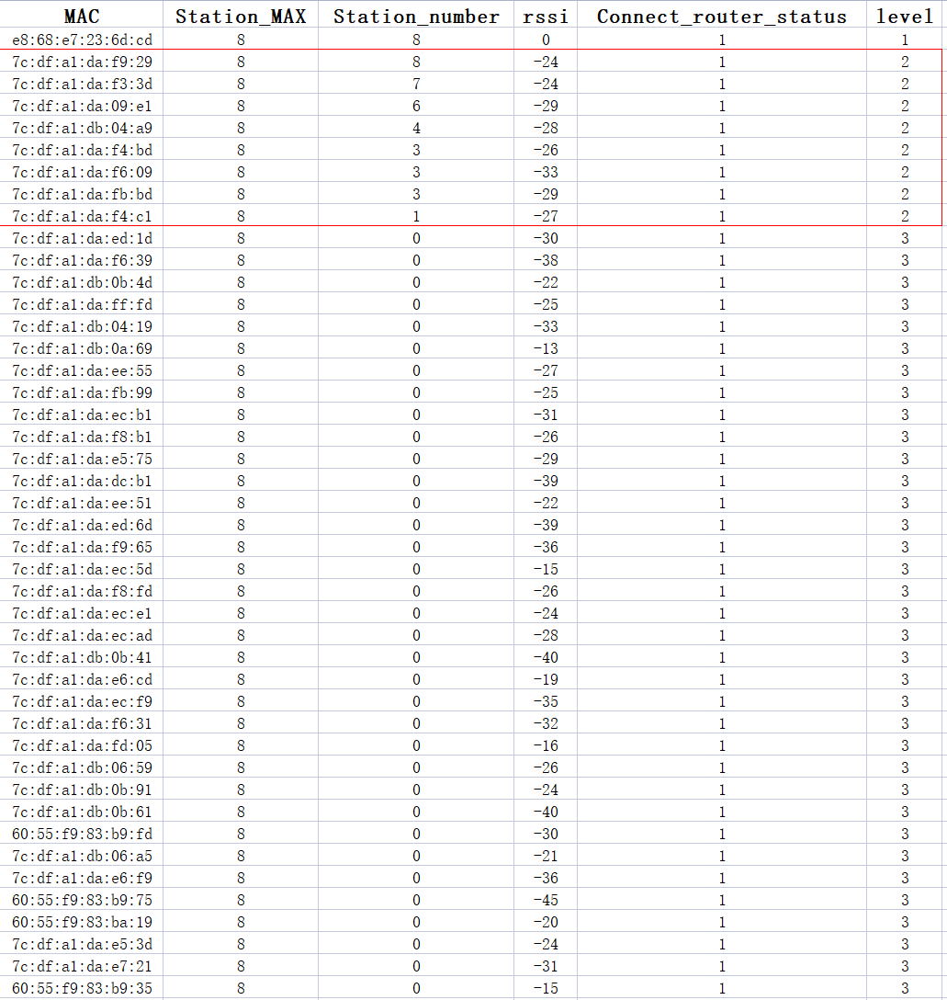

# LiteMesh 功能简介

## 1.概述

Wi-Fi 路由器以及无线网卡方案均可使能 LiteMesh 功能，该功能主要是为了实现一种简单的 Wi-Fi Mesh 组网，在 SoftAP beacon 包中增加 Vendor IE 信息来表示该结点的信息和状态。

## 2.Vendor IE 信息内容及含义

|      | max connect number     | station number                | router rssi | connect router status                  | level          |
| ---- | ---------------------- | ----------------------------- | ----------- | -------------------------------------- | -------------- |
| 长度 | 1 Byte                 | 1 Byte                        | 1 Byte      | 1 Byte                                 | 1 Byte         |
| 含义 | 本节点允许的最大连接数 | 已连接到本结点的 Station 个数 | 父结点 RSSI | 本结点或父级结点是否已连接到外部路由器 | 本结点所属层级 |

## 3.流程介绍

- ESP 设备上电后会首先进行扫描，如果扫描到有对应 VENDOR_OUI 的 Vendor IE 信息，便会进行记录
- ESP 设备会优先连接到层级最高的且 Station 连接个数未到最大连接数的结点，连接成功后启动 SoftAP
- 若未扫描到对应 VENDOR_OUI 的 Vendor IE 信息，则自己会作为一个根节点并启动 SoftAP，外部设备连接至该热点后可以给该组网配网，使其连接至外部路由器

## 4.示例

以下为采用 44 台 ESP32-C3 进行的组网测试

