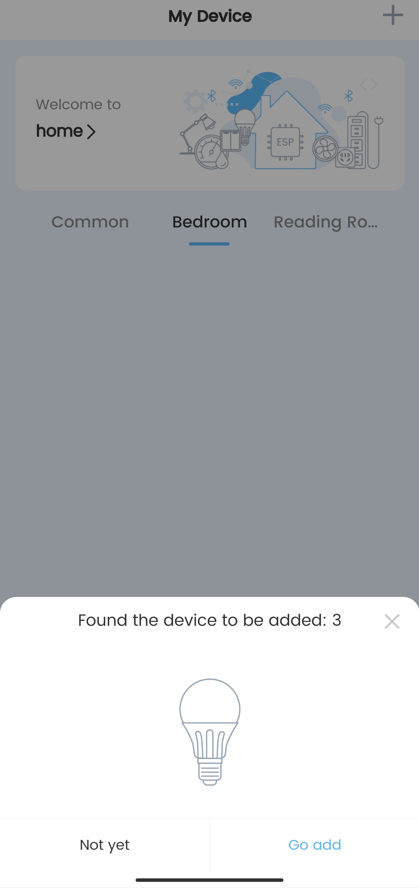
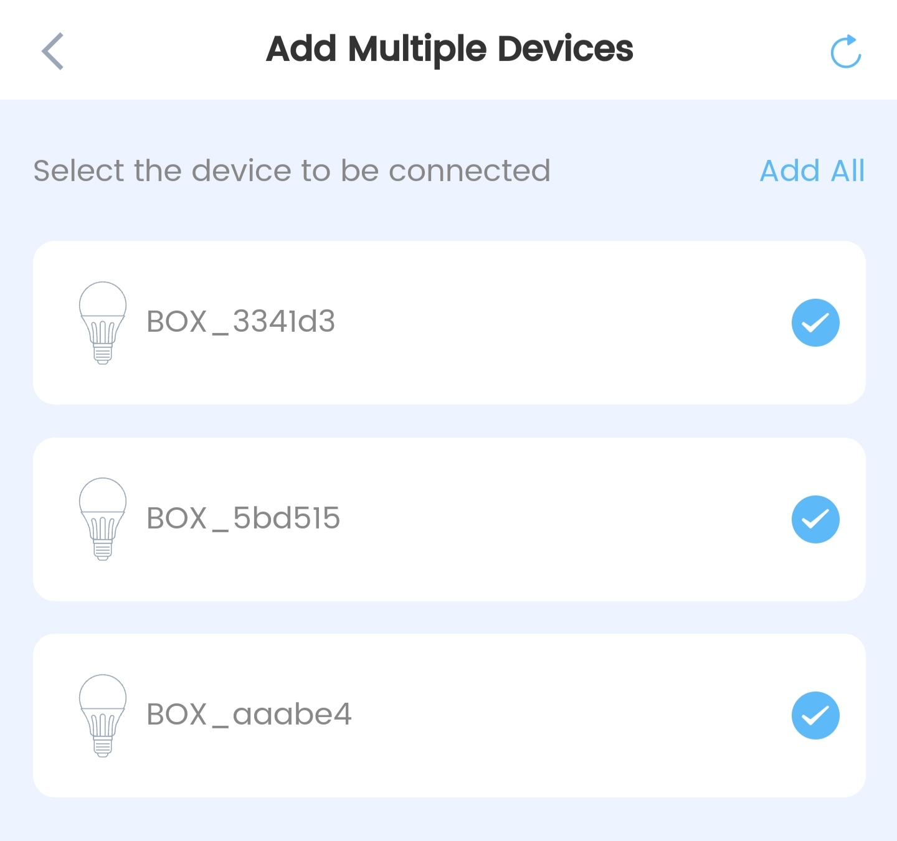
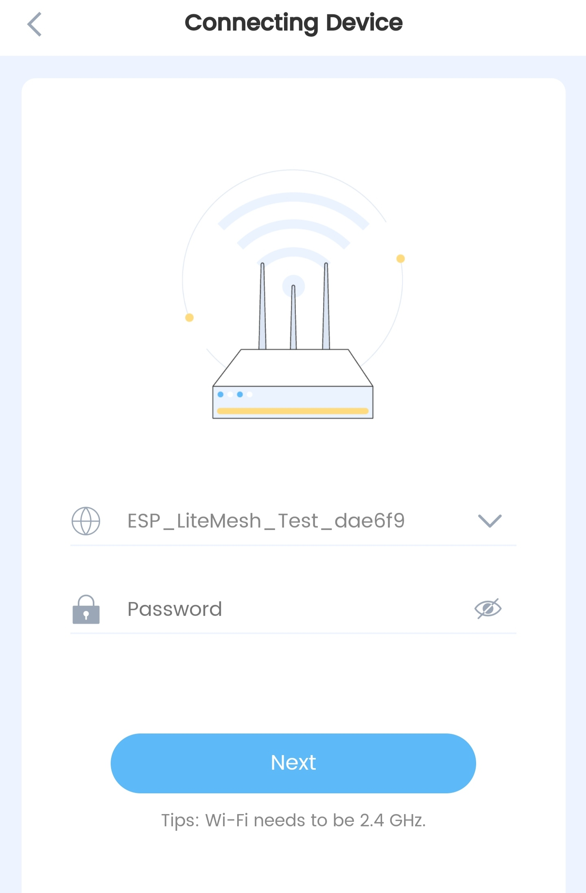
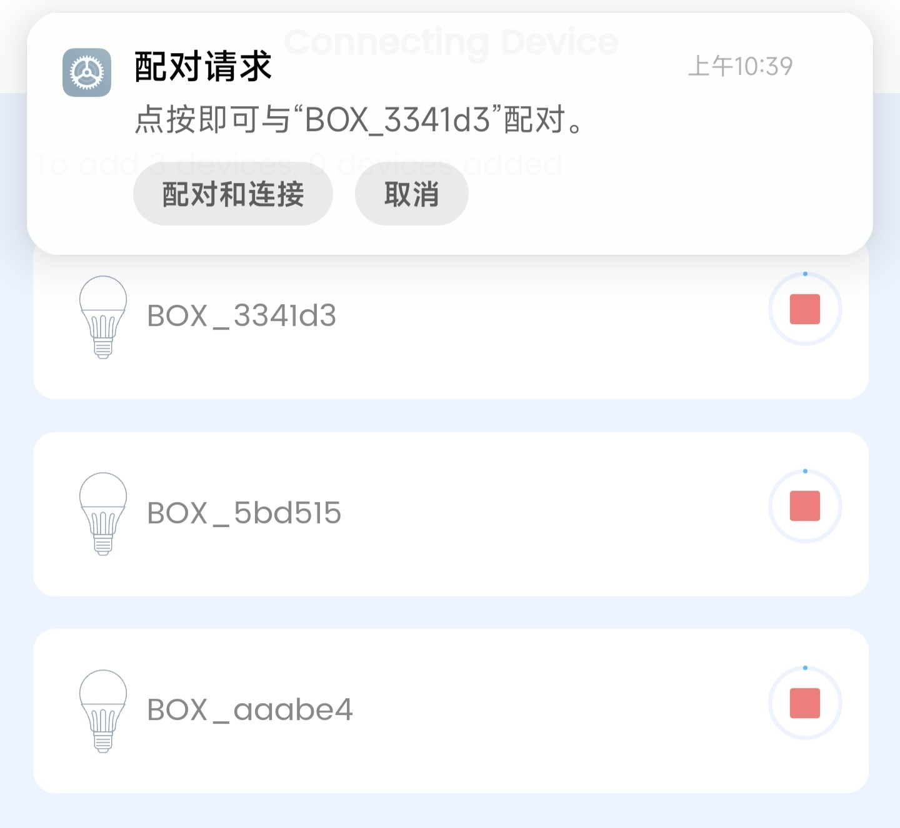
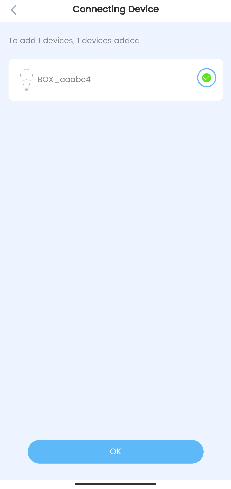
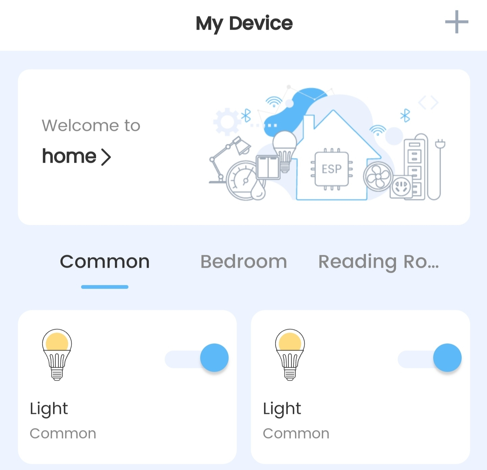

# LED Light Example(Nove Home)

This example uses the Rainmaker cloud platform to demonstrate the ESP-Bridge **Wi-Fi router** function. User can configure the device through the `Nove Home` APP and successfully connect to the Rainmaker cloud. The device is connected to the cloud based on Rainmaker, It can also provide other devices with the ability to surf the Internet wirelessly, and form a network with the Mesh-Lite function, which greatly reduces the load on the router and expands the wireless communication range.

## Get Start

### 1. Apps

- [Google PlayStore](https://play.google.com/store/apps/details?id=com.espressif.novahome)
- [Apple App Store](https://apps.apple.com/us/app/nova-home/id1563728960)

### 2. Get Key

Currently, there are two ways for a device to obtain a certificate:

- Self Claiming: After the network is configured, the device directly sends an http request to pull the certificate from the server, which can only be applied on **ESP32-S3** and **ESP32-C3**. Due to the binding with the MAC, the certificate pulled by each device is the same each time.
- Assisted Claiming: When configuring the network, the mobile APP requests a certificate from the server, and then sends it to the device through Bluetooth. It is not bound to the MAC. By default, an account has a limit of 5 applications.

Currently, ESP32-S3 and ESP32-C3 use Self-Claiming to obtain certificates by default, while ESP32 can only use Assisted Claiming to obtain certificates.

> Nova Home's Assisted Claiming method is currently unstable. If you use ESP32 to obtain a certificate, it is recommended to use the [ESP Rainmaker](https://github.com/espressif/esp-rainmaker#phone-apps) APP for Claiming

### 3. IDF environment setup & SDK

Refer to [README](../../../README_EN.md)

### 4. Add esp-rainmaker patch

```
cd esp-iot-bridge/components/esp-rainmaker
git apply ../../idf_patch/esp-rainmaker.patch
```

### 5. Mesh-Lite function

- You can choose whether to enable the Mesh-Lite function in the menuconfig `Bridge Configuration -> The Interface used to provide network data forwarding for other devices -> Enable Lite Mesh`. This example enables this function by default.
- If the Mesh-Lite function is enabled, the first networked device will connect to the target router and serve as the root node, and subsequent devices will be connected to the root node device and act as child nodes to form a Mesh-Lite network. For details, please refer to [Mesh-Lite](../../../doc/Mesh-Lite.md).

### 6. Build & Flash

After the ESP-IDF environment is successfully set up, you can execute the following commands to compile and burn the firmware.

```
$ cd esp-iot-bridge/examples/rainmaker/led_light
$ idf.py build
$ idf.py flash
```

### 7. Add devices to Nove Home

- Open `Nove Home`, the APP will automatically search for the device to be configured



- Add devices



- Enter distribution network information



- Pair and connect to configure the network



- Distribution network is successful



- LED control



### 8. Precautions

- Currently `Nove Home` only supports Wi-Fi Provisioning over Bluetooth Low Energy, so this example does not support ESP32-S2 chip currently.
